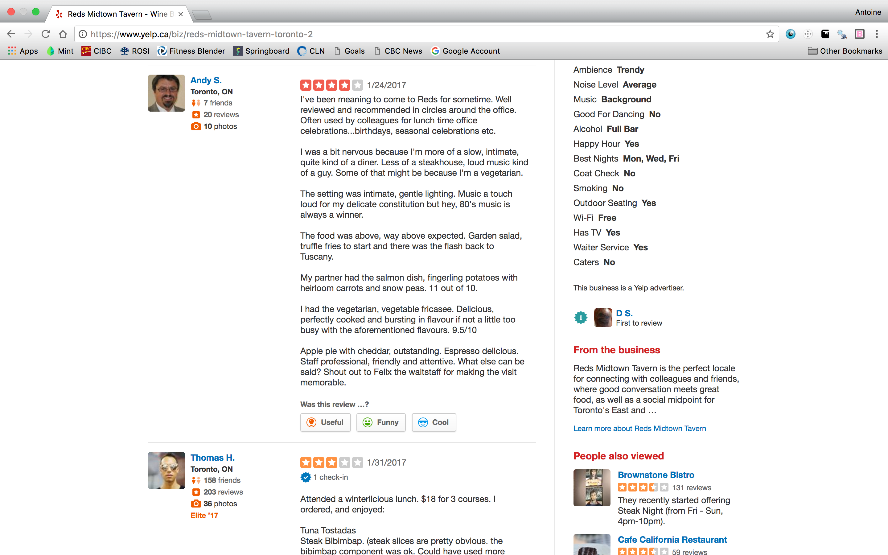
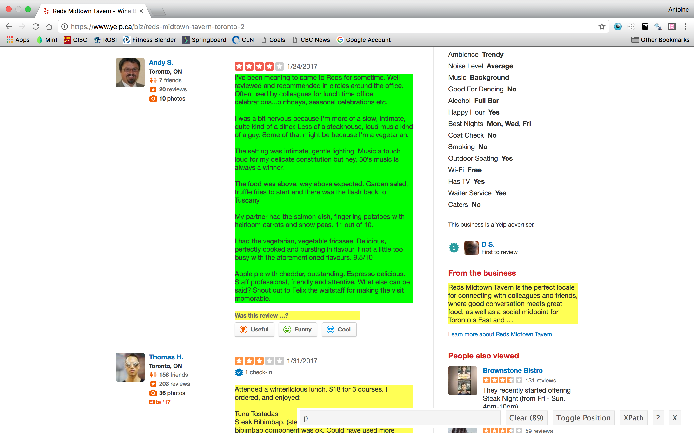
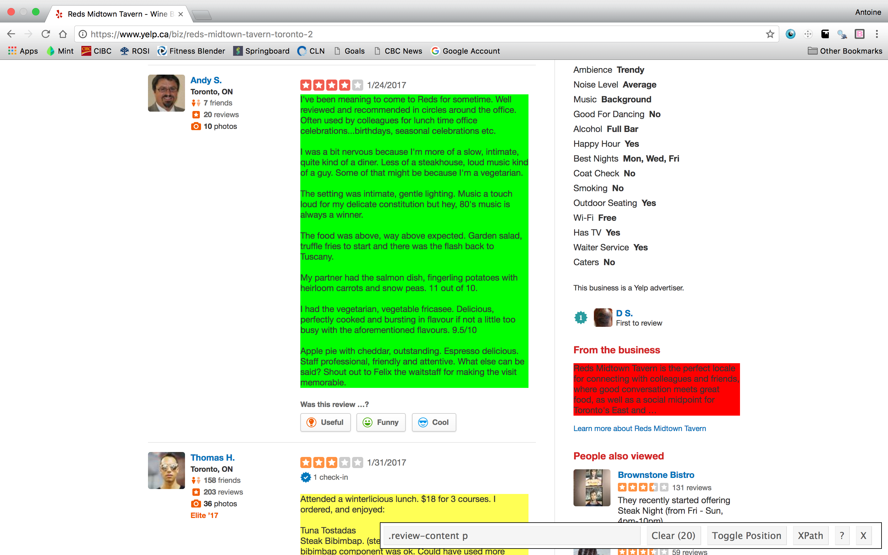
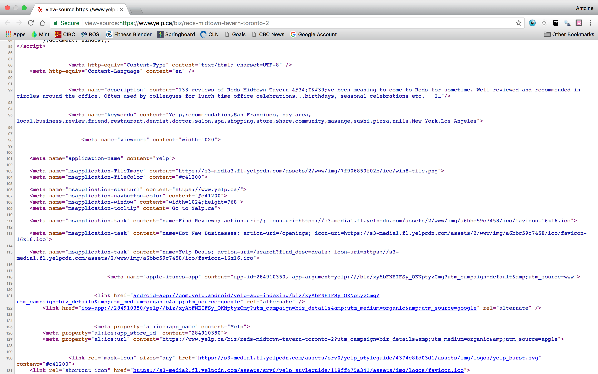

#Introduction

In this report, I intend to elaborate on how we can use tools available in R to acquire and manipulate data from the web. This is incredibly useful if we are interested in performing any sort of text analysis using webpages as our source. I intend to use the tools and methods introduced here to ultimately perform a sentiment analysis of user reviews for REDS Midtown Tavern in Toronto, Ontario. The restaurant's website is located here: www.redsmidtowntavern.com. This report is divided into two primary sections: data gathering and data cleaning. In the former, I discuss the methods and tools I used to gather customer review data for REDS from popular review websites. In the second section, I go into detail about the process I used to clean the raw data obtained from these websites. 

Before we dive in, let's load some libraries and set the working directory. 

```{r}
CapstoneDir = "/Users/Antoine/Documents/Work/DataScience/Springboard/FoundationsofDataScience/CapstoneProject"

setwd(CapstoneDir)

rm(list=ls())
```


#Data Acquisition

As mentioned in the Introduction, the aim of this project is to perform a sentiment analysis of REDS Midtown Tavern, based on available customer reviews. It is well known that there is a wealth of such information on the internet, contained on review and travel websites. For the purpose of this investigation, I have focussed my efforts on the following websites: https://www.yelp.com/toronto, https://www.opentable.com/toronto-restaurants, https://www.tripadvisor.ca/, and https://www.zomato.com/toronto. Though this data is readily available for us to see and read, we would like to acquire it in a more structured way, so as to facilitate processing and analysis. This can be done fairly simply using a variety of tools available online. More specifically, I gathered the review data from the aforementioned websites by using the `rvest` package in R (https://cran.r-project.org/web/packages/rvest/index.html) and the web scraping tool, SelectorGadget (http://selectorgadget.com/). 

## SelectorGadget and CSS Selectors

### Identifying Content with SelectorGadget

Before I begin discussing the web scraping process in depth, I want to spend some time discussing SelectorGadget. SelectorGadget is a wonderful open source tool that allows us to obtain CSS selectors on a website by clicking on select items of interest.  CSS Selectors are what allows us to gather data from the web by using packages such as `rvest`. The difficulty arises in identifying which selectors are associated with which content on a webpage. Traditionally, one might attempt to identify a selector for specific content by scouring the HTML source code for a website. Though it is doable, this isn't exactly effortless. SelectorGadget greatly improves this process by providing a point-and-click interface between the webpage content and the underlying selector. 

I will elaborate on this using a relevant example. Here is the Yelp webpage for REDS Midtown Tavern: https://www.yelp.ca/biz/reds-midtown-tavern-toronto-2. Our goal is to scrape this webpage for the customer reviews, which are located not too far into the page: 




By running the SelectorGadget, which manifests itself as the grey search bar at the bottom of the page, we can select the first review to start identifying the relevant CSS Selector: 




We see that the SelectorGadget has returned the CSS Selector "`p`". This selector includes the customer reviews, which is what we want, but it also includes additional content, such as "Was this review ...?" and the text under the heading "From the business". We don't need these elements of the webpage. The content that we have selected via point-and-click has been coloured in green, while the content that matches that selector has been highlighted in yellow. This is the initial stage in our filtering process. We can now choose to add additional content to our filter by clicking on content that is not yet highlighted, or we can remove content from our filter by clicking on content that has been highlighted. In this case, we want to click on the text below "From the business" to remove it from our selection. 




We see that content that had previously been highlighted but is now de-selected becomes red. We also notice that the text "Was this review...?" is now no longer included in our selection. It appears that the CSS selector "`.review-content p`" is the correct selector associated with the review content on this webpage. We can verify this by noting that SelectorGadget has found 20 items matching this selector, which corresponds to the number of reviews on this page. Now that we have the selector that we want, we can import the data into R. This will be done in detail below. 

### CSS Selectors in Detail

When working with SelectorGadget, it is helpful to understand a little about CSS selectors. In essence, CSS selectors allow us to identify given "blocks" of content within an HTML source file. An excellent hands-on tutorial that allows you to get a feel for CSS selectors and how to work with them is found at the following website: https://flukeout.github.io/. This section will loosely follow the layout of this tutorial. 

An HTML file is comprised of different blocks of content, which are identified by their **type**. For example, `<p>` represents a paragraph block, `<a>` a hyperlink, `<h1>` a heading, and so on. An screenshot of the HTML source file for  https://www.yelp.ca/biz/reds-midtown-tavern-toronto-2 is included in Figure 2.4. To learn more about HTML formatting, visit this website: https://www.w3schools.com/html/default.asp




The most basic CSS selector is simply a selector of type. To obtain all content that is contained within a paragraph block, simply use the selector "`p`". In fact, this is what happened when we used SelectorGadget in Figure 2.2: the customer review content was contained in a parapraph block, but so was other content that we didn't need. Using the selector `p` identified all of this content. 

In order to diversify content, HTML types can be associated with an **ID** or with a **class**. For example, `<div id="title">` or `<div class="section">`. These are both `<div>` blocks, but one has an ID called "title" and the other has a class called "section". In addition to type, content can be extracted from a webpage by selecting it based on ID or class. The CSS selector for an ID is a hashtag, `#`. E.g. if there exists a block defined by `<div id="title">` in the HTML file, we can select that element by using the selector `#title`. This will select all content with `id="title"`, including but not limited to the content that we want. Similarly, the selector for a class is a period, `.`. E.g. we can select `<div class="content">` using `.content`. 


Now that we have these basic selectors, we can combine them to access more specific content. One such way is using the **descendant selector**. This allows us to select content that is nested within a content block. The descendant selector consists of writting two selectors separated by a space. E.g. We could select `<div id="title"><p> Text </p></div>` with the selector `div p`. This selects paragraph content within a `<div>` block. We can also use the descendant selector with the ID or class selectors. E.g. `#title p` will select all paragraph content contained within a block of any type with an `id="title"`. 

In Section 2.1.1, we used the selector `.review-content p` to obtain the customer review data from Yelp. With our new understanding of CSS selectors, we see that this uses a descendant selector with the class and type selectors. We are selecting the paragraph blocks, `<p>`, within blocks with `class="review-content"`.

Finally, specific class content can be selected by combining the class selector with the type selector, in the following way: `type.class`. E.g. if there exists both `<div class="section">` and `<span class="section">` withtin the HTML file, we can select the `<div>` block specifically using `div.section`, rather than just `.section`, which would additionally select the `<span>` block.

This covers the basics of CSS selectors. This should provide some context for what SelectorGadget is returning when clicking on webpage content. For a more detailed look at CSS selectors, follow the complete tutorial at https://flukeout.github.io/.  


##Importing Web Data with `rvest`

In the previous Section, we discussed how to work with SelectorGadget to identify content that we want to acquire from webpages. Once the correct CSS selectors are obtained for the content that we want to acquire, the next step is to load this data into R. This step of the data gathering process was performed using Hadley Wickham's web data R package, `rvest`.

`rvest` allows us to gather data from the web using a few basic functions: `read_html()`, `html_nodes()`, `html_text()`, and `html_attrs()`. 

Consider once again the problem of scraping reviews for REDS Midtown Tavern from Yelp. In Section 2.1.1, we identified that the correct CSS selector for this content was `.review-content p`. This is great, but what do we do with this? This is where `rvest` comes in. 

Let's start by loading the package. If it isn't already installed, install it using `install.packages()`.

```{r}
suppressMessages(library(rvest)) 
```

The first step in working with `rvest` is to provide R with the URL for the website that we want to scrape. This is done using the `read_html()` function. 

```{r}
YelpURL <- "https://www.yelp.ca/biz/reds-midtown-tavern-toronto-2"
YelpURL_data <-read_html(YelpURL)
print(YelpURL_data)
```


This saves the information about the URL to our console. Next, we extract the content that we want using the CSS selector that we identified with SelectorGadget. Here we use `html_nodes()` with the arguments being the HTML documents and the CSS selector. 

```{r}
YelpReviews <- html_nodes(YelpURL_data, ".review-content p")
head(YelpReviews)
```

We now have the customer reviews from Yelp stored in an object of class `xml_nodeset`. This isn't the easiest way to work with the data so the next step is to convert this to `character` class. The first way to do this is simply to use the `as.character()` function. 

```{r}
YelpReviews_char1 <- as.character(YelpReviews)
head(YelpReviews_char1, n=2)
```


This converts all of the data to `character` class, including the HTML formatting tags. This can be useful if the formatting is needed. If we are solely interested in the text stored within the paragraph block, however, we can use `html_text()` to extract this data directly. 

```{r}
YelpReviews_char2 <- html_text(YelpReviews)
head(YelpReviews_char2, n=2)
```

In this case we have the text in character format, but without the HTML tags associated with the content. Note that `html_text()` only works if there is text to extract, obviously.

Other useful functions to extract data from these HTML nodes are the `html_attrs()` and `html_attr()` functions. Looking at `YelpReviews`, we see that the HTML tag is `<p lang="en">`. Thus the paragraph blocks are associated with an **attribute** called `lang`. We can pull all the attributes from our HTML data using `html_attrs()`.  

```{r}
head(html_attrs(YelpReviews), n=3)
class(html_attrs(YelpReviews))
```


The output is a list containing the attribute (`lang`) and the value (`"en"`). We can further extract the value of a specific attribute using `html_attr()`. 

```{r}
head(html_attr(YelpReviews, "lang"))
class(html_attr(YelpReviews, "lang"))
```

This is particularly useful when information that we want is stored within such attributes, rather than within the main content block. One example of this is the numerical rating of the restaurant, included in the customer reviews. On Yelp this is presented as a number of stars filled in with the colour orange. Let's extract this data and see what it looks like. The correct CSS selector is `.rating-large`.

```{r}
YelpRatings <- html_nodes(YelpURL_data, ".rating-large")
as.character(YelpRatings)[1]
```


Here we see that the value that we want, in this case "4.0 star rating", is actually contained within the `"title"` attribute of the `<div`> block. It can also be obtained from the `"alt"` attribute of the `` block. Let's see what `html_attrs()` gives us. 

```{r}
head(html_attrs(YelpRatings), n=3)
```


These are only the attributes of the `<div>` block. The reason for this is that our selector, `.rating-large`, only selects this block. To select the nested `` block, we would use the descendant selector `.rating-large img`. From the `div` block we can extract the numeric rating by using the `title` attribute.

```{r}
YelpRatings_clean <- html_attr(YelpRatings, "title")
head(YelpRatings_clean)
```

The next step here would be to use regular expressions to isolate the number and then convert the data to `numeric` class for quantitative analysis.

## Gathering Capstone Data 

With a basic understanding of CSS selectors, SelectorGadget, and `rvest`, we are equipped to gather our customer review data. As mentioned previously, the following websites were used as data sources: Yelp(https://www.yelp.com/toronto), OpenTable(https://www.opentable.com/toronto-restaurants), Trip Advisor(https://www.tripadvisor.ca/), and Zomato (https://www.zomato.com/toronto).

The data that we are going to acquire is as follows: customer reviews, customer ratings, and dates of reviews. 

Note that the code presented in this section will not be executable due to the longer computation times. 

Let's start by wiping our working environment and loading the necessary packages.

```{r}
rm(list=ls())

#Load required libraries
suppressMessages(library(rvest))
suppressMessages(library(dplyr))
library(tidyr)
suppressMessages(library(readr))
```

I have coded the data gathering process into a number of functions, one for each website. The algorithm for each function is straightforward: 

1. Read the HTML document using the correct URL
2. Gather review, rating and date data from the webpage. Additional data may be gathered as needed. 
3. Append new data to vectors for each of the variables
4. Check to see if we have reached the end of the reviews
5. Increment counter and identify URL for next page of reviews

An important part of this process was identifying the structure of the URLs of the various review pages in order to go through them automatically. It was also important to see what data was available from each of the webpages and how to access that data.

Let's begin with Yelp. 

### Yelp Data

```{r eval=FALSE}

######################### Function: YelpScrape ###############################
#
# This function is used to scrape review data from Yelp.com
# Arguments: 
# BaseURL: URL to the first page of reviews that you want to scrape

YelpScrape <- function(BaseURL) {

  ReviewCount <- 0 #Counter for the number of reviews. On the Yelp there are 20 per page
#Empty character vectors for the reviews and ratings
  Reviews <- character(0) 
  Ratings <- character(0)
  Dates <- character(0)
  PrevRev <- character(0)
  flag <- 1

  #Now let's iterate over the different Yelp review pages and scrape the data. 
  while(flag==1){
  
    #Yelp URL for the given review page
    page_url <- paste(BaseURL,"?start=",as.character(ReviewCount),sep="")
  
    #Scrape the reviews and ratings from the current URL
    ReviewsNew <- read_html(page_url) %>% html_nodes(".review-content p") %>% html_text
    RatingsNew <- read_html(page_url) %>% html_nodes(".rating-large") %>% html_attr("title")
    DatesNew <- read_html(page_url) %>% html_nodes(".biz-rating-large .rating-qualifier") %>% html_text()
    PrevRevNew <- read_html(page_url) %>% html_nodes(".biz-rating-large .rating-qualifier") %>% as.character()
    
    print(paste("Scraping Yelp page",ceiling(ReviewCount/20)))
    
    #Append new reviews/ratings to existing vectors
    Reviews <- c(Reviews,ReviewsNew)
    Ratings <- c(Ratings,RatingsNew)
    Dates <- c(Dates, DatesNew)
    PrevRev <- c(PrevRev,PrevRevNew)
    
    #Increment the review counter to move to the next page in the following iteration
    ReviewCount=ReviewCount +length(ReviewsNew)
    
    #Loop ending condition
    flag <- if(length(ReviewsNew)==0){0} else {1}
    
  }

 return(list("Reviews"=Reviews, "Ratings"=Ratings, "Dates"=Dates, "PrevRev"=PrevRev))
}

```

The main issue that arose when scraping Yelp was that there was a discrepancy in the number of reviews and the number of ratings. This occurs because the ratings data includes data from previous reviews that have since been updated, as well as the corresponding updated reviews. The reviews data only picks up the new reviews. The variable `PrevRev` contains information about whether a review is considered a "previous review" or not. This will be used later on to identify which reviews are previous reviews. 

### OpenTable Data

```{r eval=FALSE}

######################### Function: OpenTableScrape ###############################
#
# This function is used to scrape review data from opentable.com
# Arguments: 
# BaseURL: URL to the review page from open table. Note that the URL must end with &page= 
# without specifying the page number. Page number is specified in the function.


OpenTableScrape <- function(BaseURL) {

  # Parameters
  ReviewCount <- 1
  Reviews <- character(0)
  Ratings <- character(0)
  Dates <- character(0)
  flag <- 1
  
  while(flag==1) {
  
    #Get URL for current page
    page_url <- paste(BaseURL,as.character(ReviewCount),sep="")
    
    #Obtain data from page
    ReviewsNew <- read_html(page_url) %>% html_nodes("#reviews-results .review-content") %>% html_text
    RatingsNew <- read_html(page_url) %>% html_nodes("#reviews-results .filled") %>% html_attr("title")
    DatesNew <- read_html(page_url) %>% html_nodes(".review-meta-separator+ .color-light") %>% html_text()
    
    #Append vectors
    Reviews <- c(Reviews,ReviewsNew)
    Ratings <- c(Ratings,RatingsNew)  
    Dates <- c(Dates,DatesNew)
    
    print(paste("Scraping OpenTable page",ReviewCount))
    
    #Increment counter
    ReviewCount <- ReviewCount+1
    
    #This condition checks whether we have reached the end of the reviews
    flag <- if(length(ReviewsNew)==0){0} else {1}
  }
  return(list("Reviews"=Reviews, "Ratings"=Ratings, "Dates"=Dates))
}

```

The web scraping process for OpenTable is more straightforward than Yelp, though there are some hiccoughs in the data that we will clean in subsequent sections. 

### Trip Advisor Data

When scraping reviews from Trip Advisor, a difficulty arises in that the URL for each of the review pages does not appear to have an obvious pattern. In order to acquire all the reviews, I had to find a way to work around this. Luckily enough, the URL for the subsequent review page is actually contained within the HTML document of the current review page, as part of the link to the next page. Therefore to get the URL for the next page, all I had to do was identify the selector for this link, and extract the data. 

Another feature that I've implemented is that the web scraping process actually begins at the landing page for REDS Midtown Tavern (https://www.tripadvisor.ca/Restaurant_Review-g155019-d5058760-Reviews-Reds_Midtown_Tavern-Toronto_Ontario.html), rather than at the first full review page. The function then jumps from this landing page to the first full review page by "clicking" on the title of the first available review. The reason for this is that, when attempting to go straight to the first full review page, I noticed that new reviews were not being included in this "first" page. The page was effectively dated to when I had first obtained the URL. Jumping from the landing page for REDS Midtown Tavern to the first full review page allows me to bypass this problem, since new reviews are included on the landing page. 

```{r eval=FALSE}

######################### Function: TripAdScrape ###############################
#
# This function is used to scrape review data from Trip Advisor
# Arguments:
# LandingURL: This is the URL for the landing page of the restaurant you want to scrape for. 
# It will be used to link to the full review pages

TripAdScrape <- function(LandingURL) {


  #This gets the links to the review pages, which are embedded in the review titles
  ReviewTitleLink <- read_html(LandingURL) %>% html_nodes(".quote a") %>% html_attr("href")
  
  #The base URL to the first review page is
  BaseURL <- paste("https://www.tripadvisor.ca",ReviewTitleLink[1],sep="")
  
  #Set parameters for data scraping. 
  ReviewCount <- 1
  Reviews <- character(0)
  Ratings <- character(0)
  Dates1 <- character(0)
  Dates2 <- character(0)
  flag <- 1 
  
  while(flag==1){
  
    print(paste("Scraping Trip Advisor page",ReviewCount))
    
    #For the first page, the URL we want to use is just the base URL. For subsequent
    #iterations, we want to grab the hyperlink to the new page from the page links 
    #in the previous page. E.g. page 1 carries a link to page 2 in its HTML, and so on. 
    if(ReviewCount == 1){
      
      page_url <- BaseURL
      
    } else {
      
      #Grab the page numbers for the links
      pagenum <- read_html(page_url) %>% html_nodes(".pageNum") %>% html_attr("data-page-number") %>% as.numeric()
      #Grab the hyperlinks for the subsequent pages
      hyperlink <- read_html(page_url) %>% html_nodes(".pageNum") %>% html_attr("href") %>% as.character()
      #New URL
      page_url <- paste("https://www.tripadvisor.ca",hyperlink[pagenum==ReviewCount],sep="")
    
    }
    
    #Read in reviews and ratings from current page
    ReviewsNew <- read_html(page_url) %>% html_nodes("#REVIEWS p") %>% html_text()
    RatingsNew <- read_html(page_url) %>% html_nodes("#REVIEWS .rating_s_fill") %>% html_attr("alt")
    DatesNew1 <- read_html(page_url) %>% html_nodes(".relativeDate") %>% html_attr("title",default=NA_character_)
    DatesNew2 <- read_html(page_url) %>% html_nodes(".ratingDate") %>% html_text()
    
    
    #End loop condition
    flag <- if(length(ReviewsNew)==0){0} else {1}
    
    #Append new reviews/ratings
    Reviews <- c(Reviews, ReviewsNew)
    Ratings <- c(Ratings, RatingsNew)
    Dates1 <- c(Dates1, DatesNew1)
    Dates2 <- c(Dates2, DatesNew2)
    
    #Increment page count
    ReviewCount <- ReviewCount+1  
    
  }

  return(list("Reviews"=Reviews,"Ratings"=Ratings, "Dates1"=Dates1,"Dates2"=Dates2))
}

```

In this function I have extract two sets of data for the dates, stored in `Dates1` and `Dates2`. The reason for this is that, for recent reviews, Trip Advisor presents its date information in the following form: "Dined ## days ago" or "Dined yesterday". This is not useful for analysis. However, the actual dates for these recent reviews can be obtained using the selector `.relativeDate`. The catch is that this selector does not select the dates for those older reviews that are not expressed in the form "Dined ## days ago". This format is only used to express the most recent dates. Older reviews are associated with a proper date format. So we need a combination of both the information gathered by the `.relativeDate` and `.ratingDate` selectors. 

### Zomato Data

The final website used to extract data is Zomato. The main problem I ran into with this website was that the reviews are not written onto different URL pages. Rather, the reviews are accessed via a sort of drop down menu on the landing page. Due to this, and in the interest of time, I wasn't able to extract the full set of reviews available on Zomato. Fortunately, the reviews on Zomato are fairly outdated and, though it would have been nice to have them as part of our data, the older reviews will not play a significant part in our analysis since the restaurant has changed many times since then. 


```{r eval=FALSE}
######################### Function: ZomatoScrape ###############################

ZomatoScrape <- function(BaseURL) {

  #Set parameters for data scraping. 
  ReviewCount <- 1
  Reviews <- character(0)
  Ratings <- character(0)
  Dates <- character(0)
  flag <- 1 
  
  Reviews <- read_html(BaseURL) %>% html_nodes(".rev-text-expand , .rev-text") %>% html_text()
  Ratings <- read_html(BaseURL) %>% html_nodes(".rev-text-expand div , .rev-text div") %>% html_attr("aria-label")
  Dates <- read_html(BaseURL) %>% html_nodes("time") %>% html_attr("datetime")

  return(list("Reviews"=Reviews,"Ratings"=Ratings, "Dates"=Dates))
    
}

```

One thing to note is that, if a review on Zomato is long, it will be truncated and have an associated "read more" option on the webpage to show the full review. Reviews of this type are counted twice by SelectorGadget: once for the truncated version, and once for the full expanded version. Additionally, the format in which the ratings have been extracted is such that there will be double the amount of data, half of which consists of `NA` values. We will address these issues in the cleaning stage. 

### Web Scraping

With our web scraping functions defined, we can begin the data acquisition process. All we have to do is identify the URLs for the review pages and pass them to the functions.

```{r eval=FALSE}

#Yelp main review page URL
BaseURL_Yelp <- "https://www.yelp.ca/biz/reds-midtown-tavern-toronto-2"

#OpenTable main review page URL
BaseURL_OpenTable <- "https://www.opentable.com/reds-midtown-tavern?covers=2&dateTime=2017-02-22+19%3A00%23reviews&page="

#Trip Advisor landing page
LandingURL_TripAd <- "https://www.tripadvisor.ca/Restaurant_Review-g155019-d5058760-Reviews-Reds_Midtown_Tavern-Toronto_Ontario.html"

#Zomato main review page URL
BaseURL_Zomato <- "https://www.zomato.com/toronto/reds-midtown-tavern-church-and-wellesley/reviews"

#Scrape data from websites
YelpData <- YelpScrape(BaseURL_Yelp)
OpenTableData <- OpenTableScrape(BaseURL_OpenTable)
TripAdData <- TripAdScrape(LandingURL_TripAd)
ZomatoData <- ZomatoScrape(BaseURL_Zomato)
```

Before we save our raw data to file, we need to do some basic cleaning of the Open Table date data. The reason for this is that some of the dates are expressed in "Dined ## days ago" format. We don't have the proper date data, so we have to create it by subtracting the number of days from the current date. This only works if we do this on the same day that we scraped the web data. 

```{r eval=FALSE}
#Find all instances of dates in the form "Dined ## days ago"
DatesLogic <- grepl("[0-9]+.*ago", OpenTableData$Dates)

#Subset date info to get the instances matching the above format
DatesTemp <- OpenTableData$Dates[DatesLogic]

#Create empty character vector of length equal to DatesTemp
DineDate <- character(length(DatesTemp))

#Extract the actual date information for these instances by comparing to 
# the present date
for (i in 1:length(DatesTemp)){
  #Extract the number of days ago that the review was posted.
  dineDay <- regmatches(DatesTemp,regexpr("[0-9]+",DatesTemp)) %>% as.numeric()
  #Grab today's date
  todayDate <- Sys.Date()
  #Subtract the number of days from today's date
  DineDate[i] <- todayDate - dineDay
}

#Replace the date entries with the proper dates. Note that these are not yet formatted as date class
OpenTableData$Dates[DatesLogic] <- DineDate
```

Finally, having finish the data gathering stage, we can save our raw data to file.

```{r eval=FALSE}
#Save raw data to file
save(YelpData,OpenTableData,TripAdData,ZomatoData, file="./Data/CapstoneRawData.RData")
```


#Data Cleaning

With our raw data in hand, the next step of the process is to clean the data. There are a number of things that we would like to do:

* Remove unnecessary "previous review" data from Yelp data
* Remove the unnecessary `NA` values from Zomato ratings data
* Remove the duplicate truncated reviews from Zomato
* Consolidate `Dates1` and `Dates2` variables for Trip Advisor
* Create vectors that describe which website the data belongs to
* Merge all customer review data into a data frame
* Clean up all dates and convert to `date` class
* Clean up all ratings and convert to `numeric` class
* Clean up reviews as needed

Let's get started. 

Since the code written above is not executable, I will load the raw data from the "CapstoneRawData.RData" file. 

```{r}
load("./Data/CapstoneRawData.RData")
str(YelpData)
str(OpenTableData)
str(TripAdData)
str(ZomatoData)
```


Let's start with the Yelp data. We will remove "previous reviews", as mentioned above. We will also generate a vector that indicates that this is data from Yelp. Finally, we will merge these variables into a data frame specific to Yelp.

```{r}
#Identify which reviews are not previous reviews and discard those that do
NoPrevRev <- grepl("has-previous-review",YelpData$PrevRev) == FALSE
YelpData$Ratings <- YelpData$Ratings[NoPrevRev]
YelpData$Dates <- YelpData$Dates[NoPrevRev]

#Create vector to describe the review category as Yelp
YelpVec <- rep("Yelp",length(YelpData$Reviews))

#Combine Yelp data vectors in DF
YelpDF <- data_frame(Reviews=YelpData$Reviews,Ratings=YelpData$Ratings,Dates=YelpData$Dates, Website=YelpVec)
```

That's it for the Yelp data. Let's move on to OpenTable. Since we have already cleaned the dates prior to saving the raw data to file, we only need to create the categorical vector and merge the variables to a data frame. 

```{r}
# Create vector to describe category of OpenTable
OpenTableVec <- rep("OpenTable", length(OpenTableData$Reviews))

#Create OpenTable data frame
OpenTableDF <- data_frame(Reviews=OpenTableData$Reviews, Ratings=OpenTableData$Ratings, Dates=OpenTableData$Dates,Website=OpenTableVec)

```

To clean the Zomato data, we will remove the unnecessary `NA` values as well as the duplicate truncated reviews.

```{r}
#Remove the double values from the ratings, which take on NAs
ZomatoData$Ratings <- ZomatoData$Ratings[!is.na(ZomatoData$Ratings)]

#Remove duplicate reviews. These truncated duplicates have the regex 
# "read more" within them.
FullRev <- !grepl("read more",ZomatoData$Reviews)
ZomatoData$Ratings <- ZomatoData$Ratings[FullRev]
ZomatoData$Reviews <- ZomatoData$Reviews[FullRev]

#Create vector describe website category
ZomatoVec <- rep("Zomato", length(ZomatoData$Reviews))

#Merge to data frame
ZomatoDF <- data_frame(Reviews=ZomatoData$Reviews,Ratings=ZomatoData$Ratings, Dates=ZomatoData$Dates, Website=ZomatoVec)

```

Finally, we will clean the Trip Advisor data by consolidating the different date variables.

```{r}
#Replace dates of the form "Reviewed ## days ago" with the proper dates
TripAdData$Dates2[grepl("ago|yesterday|today",TripAdData$Dates2)] <- TripAdData$Dates1

#Create vector describing website
TripAdVec <- rep("TripAdvisor",length(TripAdData$Reviews))

TripAdDF <- data_frame(Reviews=TripAdData$Reviews,Ratings=TripAdData$Ratings,Dates=TripAdData$Dates2,Website=TripAdVec)

```

Now that the data from the individual websites is stored in a data frame, we can join these data frames together to have all of the data in one place. 

```{r}
#Merge all data frames
d1 <-suppressMessages(full_join(YelpDF,OpenTableDF))
d2 <- suppressMessages(full_join(d1,ZomatoDF))
CapstoneDF <- suppressMessages(full_join(d2,TripAdDF)) %>% group_by(Website)
str(CapstoneDF)
summary(CapstoneDF)
```


This is a great start, but so far all of our data is of `character` class. Our next goal is to clean up the date and ratings data in order to express them in more quantitative terms. 


## Cleaning Up the Dates

Let's take a look at what the dates from Yelp look like. 

```{r}
head(subset(CapstoneDF$Dates, CapstoneDF$Website=="Yelp"),n=10)

```

The first thing we need to do is get rid of the newline and space characters. 

```{r}
#Remove newline characters and spaces
CapstoneDF$Dates <- gsub("\n *","",CapstoneDF$Dates)
head(subset(CapstoneDF$Dates, CapstoneDF$Website=="Yelp"),n=10)
```


That looks better. Next we look for data that doesn't fit this pattern. 


```{r}
#Find data that doesn't fit Yelp pattern
UncleanDates <- CapstoneDF$Dates[!grepl("^[0-9].*[0-9]$",CapstoneDF$Dates)]
head(UncleanDates, n=10)

```

Following this output, we see that we need to remove the "Updated review" phrase, as well as "Dined on ". 

```{r}
#Remove "Updated review" 
CapstoneDF$Dates <- gsub("Updated review.*$","", CapstoneDF$Dates)

#Remove "Dined on "
CapstoneDF$Dates <- gsub("Dined on ","",CapstoneDF$Dates)
```

Now let's take a look at the date data from Open Table, Trip Advisor, and Zomato. 

```{r}
head(subset(CapstoneDF$Dates, CapstoneDF$Website=="OpenTable"),n=20)
head(subset(CapstoneDF$Dates, CapstoneDF$Website=="TripAdvisor"),n=20)
head(subset(CapstoneDF$Dates, CapstoneDF$Website=="Zomato"),n=20)
```


The data from Open Table and Zomato looks good. All we have to do is remove "Reviewed " from the Trip Advisor data
 
```{r}
#Remove "Reviewed "
CapstoneDF$Dates <- gsub("Reviewed ","",CapstoneDF$Dates)
head(subset(CapstoneDF$Dates, CapstoneDF$Website=="TripAdvisor"),n=20)
```

The dates data should now be stripped of unnecessary characters. The next step in our cleaning process is to express all of this data in terms of a `Date` class. This will be done in parts since the date is formatted differently for the different websites. 

Start with Yelp. 
```{r}
#Yelp date format is as follows
head(subset(CapstoneDF$Dates, CapstoneDF$Website=="Yelp"))
#grep for the Yelp dates
YelpDateRegex <- grep("^[0-9]+/.*[0-9]$",CapstoneDF$Dates)
#Given the dates, we will express them as date variables
CapstoneDF$Dates[YelpDateRegex] <- CapstoneDF$Dates[YelpDateRegex] %>% as.Date(format="%m/%d/%Y")

```

Open Table: 

```{r}
#Open Table date format:
head(subset(CapstoneDF$Dates, CapstoneDF$Website=="OpenTable"))
#grep for Open Table dates and express as date variable
OpenTableDateRegex <- grep("^([Jj]|[Ff]|[Mm]|[Aa]|[Jj]|[Ss]|[Oo]|[Nn]|[Dd]).+[0-9]+$",CapstoneDF$Dates)
CapstoneDF$Dates[OpenTableDateRegex] <- CapstoneDF$Dates[OpenTableDateRegex] %>% as.Date(format="%B %d, %Y")
```


Trip Advisor:
```{r}

#Trip Advisor date format:
head(subset(CapstoneDF$Dates, CapstoneDF$Website=="TripAdvisor"))

#grep for Trip Advisor dates and express as date variable
TripAdRegex <- grep("^[0-9]+ ([Jj]|[Ff]|[Mm]|[Aa]|[Jj]|[Ss]|[Oo]|[Nn]|[Dd]).+[0-9]+$",CapstoneDF$Dates)
CapstoneDF$Dates[TripAdRegex] <- CapstoneDF$Dates[TripAdRegex] %>% as.Date(format="%d %B %Y")

```

Finally, since Zomato dates are already in POSIXct format, we can convert them trivially to dates

```{r}
CapstoneDF$Dates[which(CapstoneDF$Website == "Zomato")] <- CapstoneDF$Dates[which(CapstoneDF$Website == "Zomato")] %>% as.Date()
```

Let's finish by imposing the `Date` class on the `Dates` variable of our data frame, just to be sure. 

```{r}
class(CapstoneDF$Dates) <- "Date"

str(CapstoneDF$Dates)

```


## Numeric Ratings

Next, do the same with numerical ratings. 

Yelp

```{r}

#What do the Yelp ratings look like? 
head(subset(CapstoneDF$Ratings, CapstoneDF$Website=="Yelp"))

#Get rid of "star rating"
CapstoneDF$Ratings <- gsub("star rating","",CapstoneDF$Ratings)
```

Open Table

```{r}
#Open Table ratings
head(subset(CapstoneDF$Ratings, CapstoneDF$Website=="OpenTable"))
```
Looks good already.

Trip Advisor

```{r}
#TripAdvisor ratings
head(subset(CapstoneDF$Ratings, CapstoneDF$Website=="TripAdvisor"))

#Get rid of "of 5 bubbles"
CapstoneDF$Ratings <- gsub("of [0-9] bubbles","",CapstoneDF$Ratings)
```

Zomato

```{r}
#Zomato ratings
head(subset(CapstoneDF$Ratings, CapstoneDF$Website=="Zomato"))

#Get rid of "Rated "
CapstoneDF$Ratings <- gsub("Rated ","",CapstoneDF$Ratings)
```

Impose numeric class and print to check. 

```{r}
#Impose numeric class
class(CapstoneDF$Ratings) <- "numeric"

str(CapstoneDF$Ratings)
```

## Final Touches

```{r}

#
CapstoneDF$Website <- factor(CapstoneDF$Website,order=FALSE,levels=c("Yelp","OpenTable","Zomato","TripAdvisor")) 

str(CapstoneDF$Website)
levels(CapstoneDF$Website)

#Let's remove newline characters from reviews
CapstoneDF$Reviews <- gsub("\n","",CapstoneDF$Reviews)

#Clean up the Zomato reviews a bit by removing the "Rated" at the beginning
head(subset(CapstoneDF$Reviews,CapstoneDF$Website=="Zomato"), n=2)

CapstoneDF$Reviews <- gsub(" +Rated *","",CapstoneDF$Reviews)

head(subset(CapstoneDF$Reviews,CapstoneDF$Website=="Zomato"), n=2)

write_csv(CapstoneDF, "./Data/CapstoneCleanData.csv")

```


#Exploratory Data Analysis


```{r}

library(readr)
library(dplyr)
library(tm)
library(wordcloud)

CapstoneDF <- read_csv("./Data/CapstoneCleanData.csv")

CapstoneCorpus <- CapstoneDF$Reviews %>% VectorSource() %>% Corpus()
inspect(CapstoneCorpus[1:2])

CapstoneCorpus <- CapstoneCorpus %>% tm_map(removePunctuation)
CapstoneCorpus <- CapstoneCorpus %>% tm_map(removeWords, stopwords("english"))
inspect(CapstoneCorpus[1:2])


TermDocMatrix <- TermDocumentMatrix(CapstoneCorpus)
inspect(TermDocMatrix)

wordmatrix <- as.matrix(TermDocMatrix)

wordfreqs = sort(rowSums(wordmatrix), decreasing=TRUE)
head(wordfreqs)

# create a data frame with words and their frequencies
WordFreqDF = data_frame(word=names(wordfreqs), freq=wordfreqs)

head(WordFreqDF)


wordcloud(CapstoneCorpus, min.freq=2,scale=c(4,0.5), max.word=200, random.order=F)

findAssocs(TermDocMatrix, "good", .20)
findAssocs(TermDocMatrix, "service", .18)
findAssocs(TermDocMatrix,"food",0.20)
findAssocs(TermDocMatrix, "great", .20)
findAssocs(TermDocMatrix, "drinks", .25)
findAssocs(TermDocMatrix, "dinner", .33)
findAssocs(TermDocMatrix, "time", .25)
findAssocs(TermDocMatrix, "atmosphere", .20)
findAssocs(TermDocMatrix, "friendly", .25)


```


