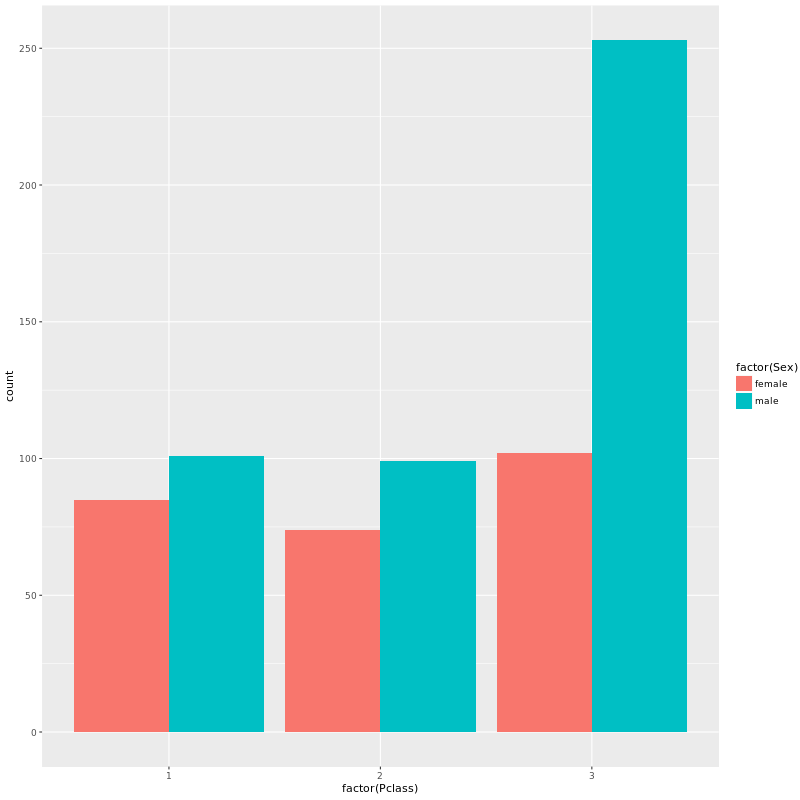
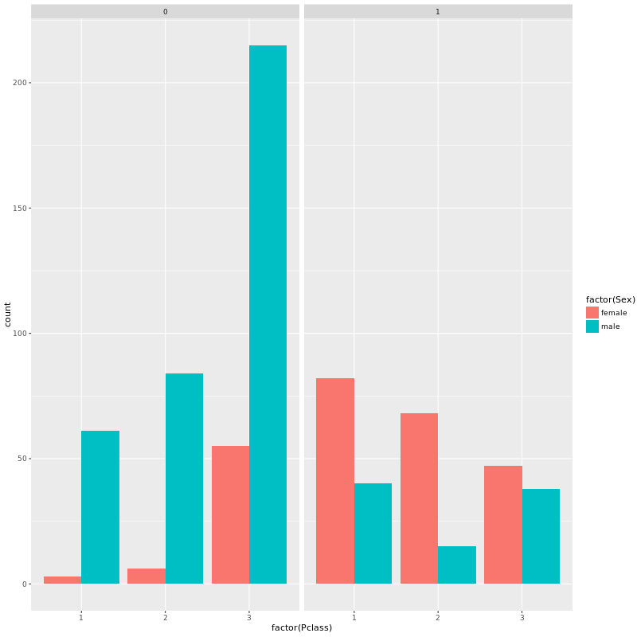
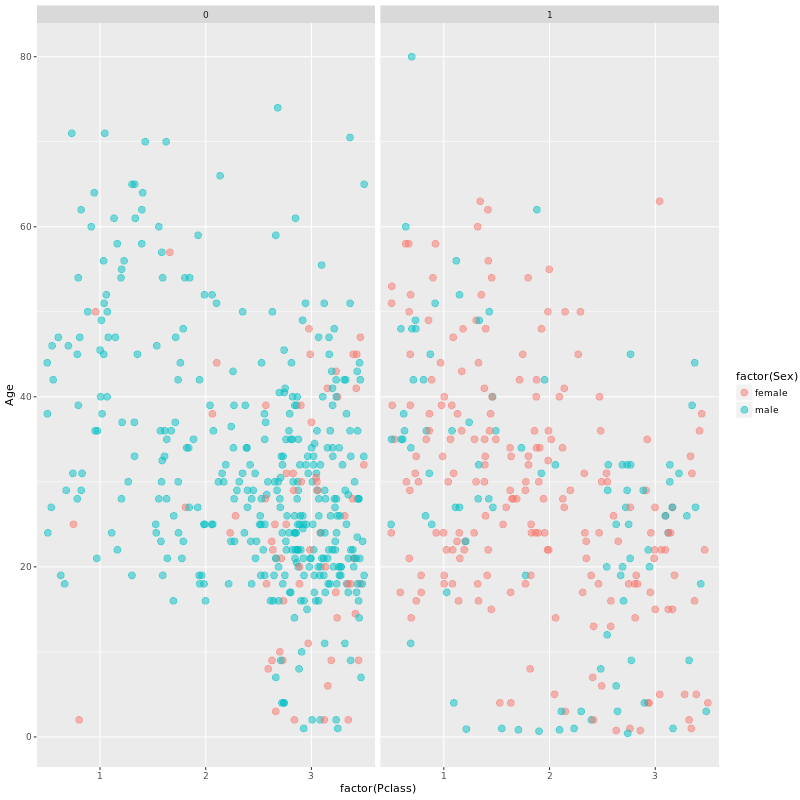

##Introduction

In this exercise, we will perform some exploratory data analysis on some data from the Titanic dataset. This code is divided into two sections: the first is the coded that was implemented in the DataCamp exercise, as is. The second section is a segment of code that performs the same analysis using the `titanic_clean.csv` data from Section 3. 

Let's load `ggplot2`:
```{r}
library(ggplot2)
```


##1. DataCamp: Titanic Exercise Code (as is)

Before we begin, note that this code will only execute if the `titanic` data frame exists in the working environment as it does on DataCamp. The `titanic` data frame is **not the same** as the `Titanic` data frame.   

Let's begin by looking at the structure of `titanic`:
```{r eval=FALSE}
str(titanic)
```

Next we will use `ggplot2` to look at the distribution of sexes within the classes of the ship:
```{r eval=FALSE}
ggplot(titanic, aes(x=factor(Pclass),fill=factor(Sex)))+geom_bar(position="dodge")
```

The resulting plot is as follows:  



The first thing to notice here is that the vast majority of passengers on the titanic were male. Not only that but they were males in the third passenger class, which is the lowest. The difference is not so significant among the females on the ship. There do not appear to be significant differences between the male/female populations within the first two classes. 

We want to improve on this plot to display information about the chances of survival among these groups. We do this by creating a facet grid: 
```{r eval=FALSE}
ggplot(titanic, aes(x=factor(Pclass),fill=factor(Sex)))+geom_bar(position="dodge") + facet_grid(".~Survived")
```
In the resulting plot, a `0` represents death while `1` represents survival:  



Once again, the most prominent group is that of third class male passengers. Sadly, this was the largest group of casualties in the shipwreck. One thing that is notable is that, within each class, the women were significantly more likely to survive than the men. 

Finally, we also want to see how survival is related to age. We will now generate a scatter plot with age mapped onto the y axis and sex mapped onto the colour scale. 

```{r eval=FALSE}
# Set the amount jitter we want
posn.j <- position_jitter(0.5, 0)
#Plot
ggplot(titanic, aes(x=factor(Pclass),y=Age,col=factor(Sex)))+geom_jitter(size=3, alpha=0.5, position=posn.j) + facet_grid(".~Survived")
```


This plot makes it even more apparent that most of the deaths were males. One point of observation is that there are almost no deaths of young people within the first two classes. This is not the case with the third class. Though some young people were saved in the third class, some also died. There are also more death than survivals among passengers over 60 years of age. Furthermore we can see that there is a cluster of third class male passengers aged 20-40 that did not survive. 


##2. Working with the `titanic_clean.csv` Data Set

In this section, we perform the same analysis on the `titanic_clean.csv` local data set. 

Let's start by clearing the working environment, loading libraries, and importing the data. 

```{r}
#Clear working environment. 
rm(list=ls())

#Load additional data wrangling libraries
suppressMessages(library(dplyr))
library(readr)

#Set the wd
path_to_wd <- file.path("~","Documents","Work","DataScience","Springboard","FoundationsofDataScience","Section4_ExploratoryDataAnalysis","Section4_Ex1")
setwd(path_to_wd)
rm(path_to_wd)

#Read in the data from titanic_clean.csv
titanic_full <- suppressMessages(read_csv("titanic_clean.csv"))

#Examine the structure of the full data.                             
str(titanic_full)     
```
 
 
Let's now create our own version of the `titanic` data frame using a `select()` command:
```{r}
#Select relevant variables 
titanic <- titanic_full %>% select(pclass,survived,sex,age)

#Examine the structure of this reduced data frame. 
glimpse(titanic)
str(titanic)
```

Now that we have our custom `titanic` data frame, let's generate the plots. 
```{r}
#Start by plotting passenger class against sex as a bar plot
ggplot(titanic, aes(x=factor(pclass),fill=factor(sex))) + geom_bar(position='dodge')
```


Notice that there is an additional category of `NA`, which we need to remove
```{r}
titanic <- titanic[!is.na(titanic$pclass),]
```

Let's plot again:
```{r}
#Passenger class against sex as a bar plot
ggplot(titanic, aes(x=factor(pclass),fill=factor(sex))) + geom_bar(position='dodge')
```


Much better. Now let's add survival information, as above. 

```{r}
#Include information about passenger survival by using a facet grid. 
ggplot(titanic, aes(x=factor(pclass),fill=factor(sex))) + geom_bar(position="dodge")+facet_grid(".~survived")
```


Finally, include age information. 
```{r}
#Set jitter amount
posn.j <- position_jitter(0.5, 0)
#Plot
ggplot(titanic, aes(x=factor(pclass),y=age, col=factor(sex))) + geom_jitter(position=posn.j, size=3, alpha=0.5)+facet_grid(".~survived")
```


One might notice that this custom dataset differs slightly from the one in the previous section, but the general trends still hold. One thing to note within this particular data is that there is a large cluster of passengers of age approximately equal to 30 across all passenger classes, both among those who survived and those who didn't. Why is this the case? 

Recall the Titanic exercise from Section 3 on Data Wrangling: When we were cleaning the original titanic data from `titanic_original.csv` (or `titanic3.xls`), we noticed that the age variable was missing for many of the passengers. In order to correct for these missing values, we assigned to these passengers an age value that was equal to the mean of the available age data. It shouldn't be a surprise, given the final plot above, that this mean value was approximately equal to 30. This explains the clustering of data around the age of 30. 

To see that this is indeed the case, let's code it out: 

```{r}
titanic_orig <- suppressMessages(read_csv("titanic_original.csv"))
age_mean <- titanic_orig %>% summarise(mean(age, na.rm=TRUE))
paste("The mean of the age variable is", age_mean[[1]])
```


Neat.


