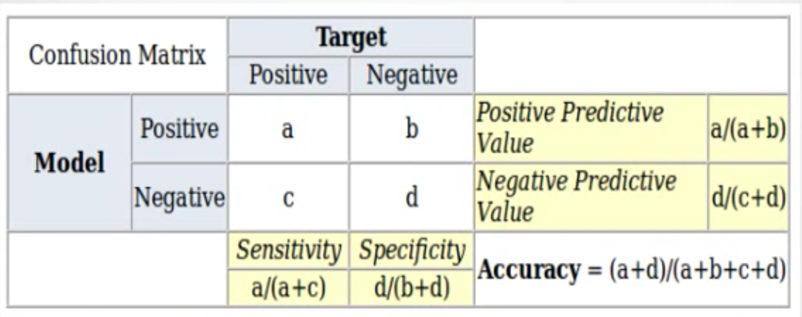
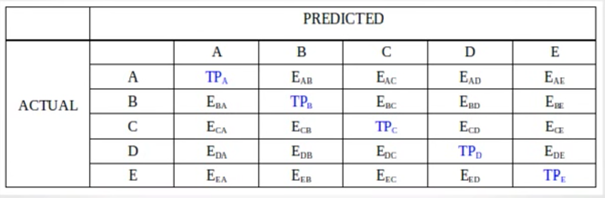
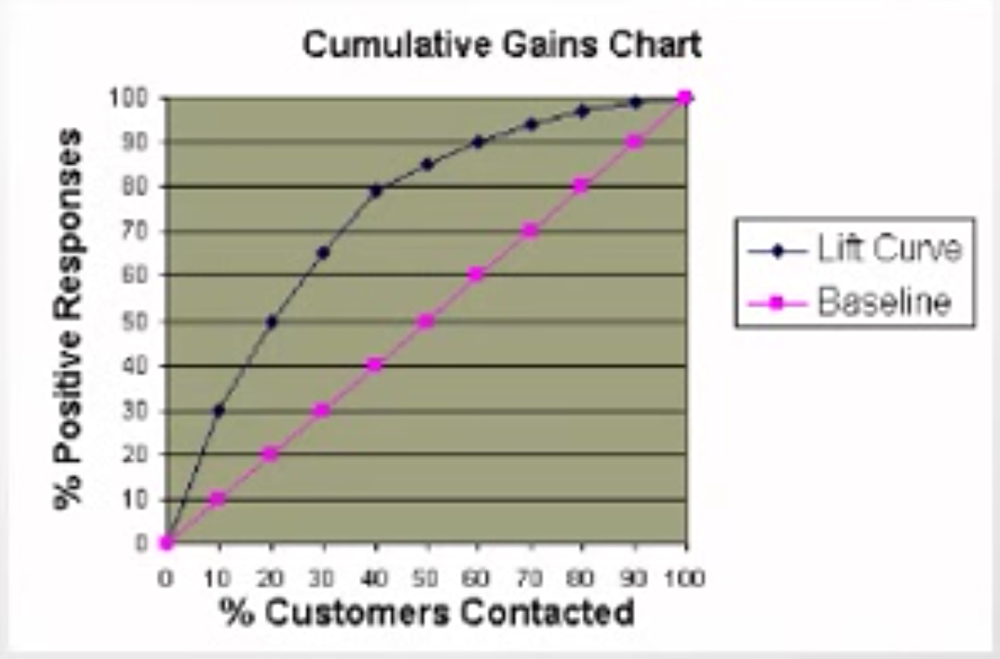
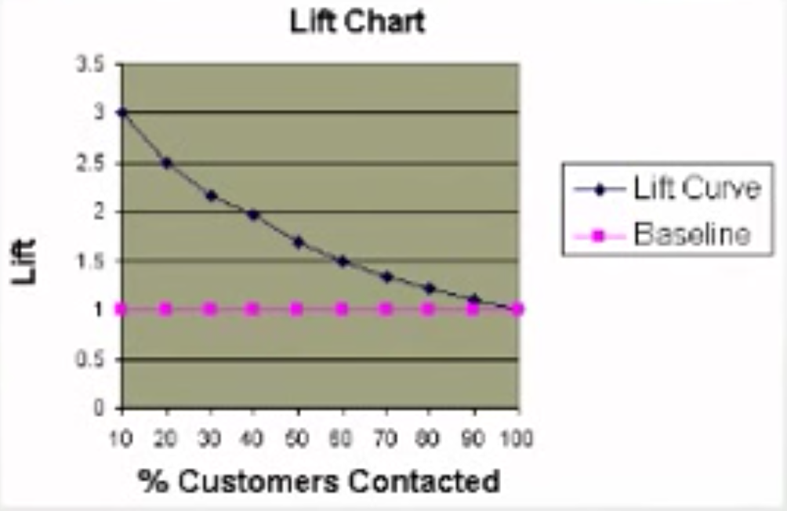
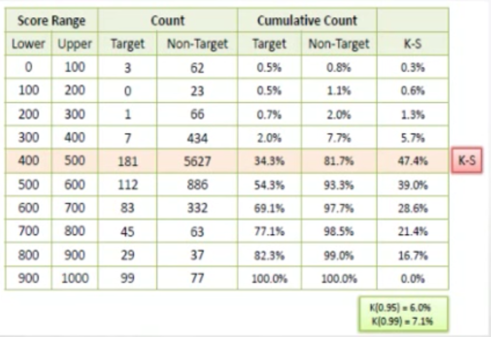
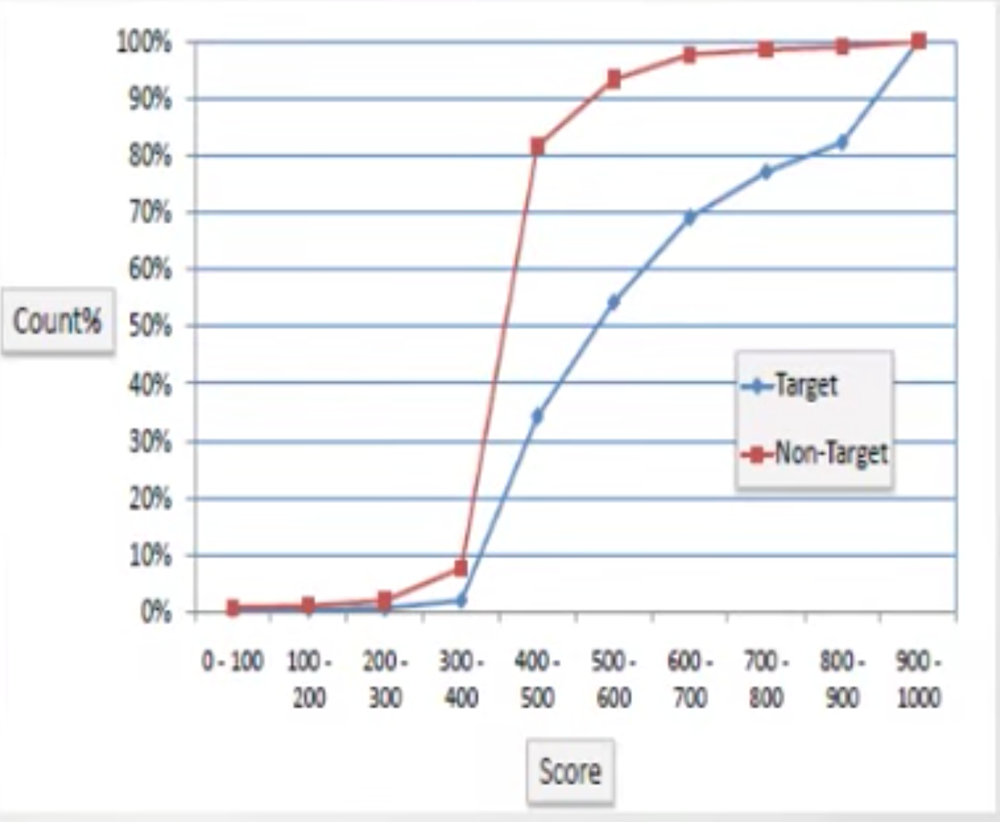

<!-- 
Some great themes: 
- Cerulean
- Flatly
- Cosmo
- paper

Some code highlights:
- Espresso
- tango
- pygments
- haddock
-->
***

#Linear Regression

## The Statistical Sommelier: An Intro to Linear Regression

### Predicting the quality of wine

Source: https://www.youtube.com/watch?v=vI3envXmyDs

In this section, we will apply linear regression to **predict the quality/prices of wines**. 

Bordeaux wines have large differences in prices and quality from year to year. Wine is meant to be aged so it’s difficult to tell if wine will be good when it hits the market. Expert tasters predict which wines will be good. 

Can we use analytics to model this process? 

In 1990, Dr. Ashenfelter used linear regression to predict wine quality. 

**Linear regression predicts an outcome, or dependent variable, based on a set of independent variables**. 

In this case, the dependent variable was the typical price in 1990-1991 wine auctions (which is used to approximate quality).

The independent variables were: age (older means more expensive), weather (average growing season temp., harvest rain, winter rain)

### One-variable Linear Regression

Source: https://www.youtube.com/watch?v=ZR_9sOun364

One-variable linear regression just uses one independent variable to predict to dependent variable. 
The goal of linear regression is to create a predictive line through the data.  

Given a set of data, there are a number of model lines that we can draw through the data. Linear regression allows us to find the optimal line to describe the data. 

In general, a one variable linear regression model is a linear equation that predicts the dependent variable, $y$:

$$y^i = B_0 + B_1x^i + e^i$$

where  
  
* $y^i$: Dependent variable for the $i$th observation (data) 
* $x^i$: Independent variable for the $i$th observation (data)
* $e^i$: Error term for the ith observation
* $B_0$: Intercept
* $B_1$: Regression coefficient for the independent variable (slope)

The error term describes the difference between each data point and the mathematical line, i.e.  

$$e^i = y^i - y(x^i)$$

where $y(x_i)$ describes the linear function. 

Our best choices of model coefficients, $B_0$, $B_1$ has the smallest errors (also called **residuals**). 

One measure for the quality of the regression line is the **sum of squared errors (SSE)**. 
This is the sum of the squared residuals, or error terms:

$$SSE = \sum_{i=1}^{N} (e^i)^2 = \sum_{i=1}^{N} (y^i - y(x^i))^2$$

The line $y(x^i)$ that **minimizes SSE** is the **regression model line**. 

SSE is hard to interpret since it scales with $N$ and the units are difficult to understand. 

A better measure is the **Root-Mean-Square Error (RMSE)**: 

$$RMSE = \sqrt{\frac{SSE}{N}}$$

RMSE is normalized by N and is in the same units as the dependent variable. 

Another common measure for a linear regression is $R^2$. 
It compares the best model to a **baseline model**, which is **the model that doesn’t use any variables**. The baseline model **predicts the average value of the dependent variable**, regardless of the independent variables (just a flat line at $y = y_{avg}$ on the graph). 

The sum of squared errors for the baseline model is often known as the **total sum of squares, or SST**.

Then, 


$$R^2 = 1 - \frac{SSE}{SST}$$


* $R^2$ captures the value added from using a model over just predicting the average outcome. 
* $R^2 = 0$ means no improvement over the mean baseline. 
* $R^2 = 1$ means a perfect predictive model (all points lie on the line)

$R^2$ is unitless and universally interpretable, but it can still be hard to compare between problems. Good models for easy problems will have $R^2 \approx 1$. Good models for hard problems can still have $R^2 \approx 0$. 


### Multiple Linear Regression

Source: https://www.youtube.com/watch?v=zthosZpYBUs

So far we have only worked with one independent variable. 

For wine prices, we can use a number of potential variables:  
 
* Average growing season temperature (AGST)
* Harvest rain
* Winter rain
* Age of wine in 1990
* Population of France

We can begin by using each variable in a one-variable regression model. 

AGST gives the best results, with $R^2 = 0.44$, followed by Harvest rain with $R^2 = 0.32$. The rest decrease. 

Multiple linear regression allows us to use all of these variables to improve our predictive ability. 

The multiple linear regression model with $k$ independent variables: 

$$y^i = B_0 + B_1x_1^i + B_2x_2^i + … + B_kx_k^i + e^i$$


The different $x_k^i$ are the different data independent variable data. The “$i$” simply represent individual data points. 

We find the following results: 

* AGST: $R^2=0.44$
* AGST, harvest rain: $R^2=0.71$
* AGST, harvest rain, age: $R^2 = 0.79$
* AGST, harvest rain, age, winter rain: $R^2=0.83$
* AGST, harvest rain, age, winter rain, population: $R^2=0.83$

We see that adding more variables can improve the model, but there are diminishing returns as more variables are added. Not all available variables should be used. Each new variable requires more data. This causes overfitting: high $R^2$ on data used to create the model, but bad performance on unseen, new data. 


### Linear Regression in R

Source: https://www.youtube.com/watch?v=5lcztJ9K42o


Let's build these regression models in R. 

```{r}
library(readr)

wine <- read_csv("wine.csv")
str(wine)
summary(wine)

#One variable linear regression
model1 <- lm(Price ~ AGST, data=wine)
summary(model1)
```

Under "Coefficients"", we can see the intercept estimate and the slope estimate. 

The Multiple R-squared is the standard $R^2$ that was discussed.   

The adjusted R-squared accounts for the number of independent variables used. 

```{r}
# The residuals (errors) for the model are stored in the following vector
model1$residuals

#Compute the SSE
SSE <- sum(model1$residuals^2)
SSE

# Let's make a multiple regression
model2 <- lm(Price ~ AGST + HarvestRain, data=wine)
summary(model2)


SSE <- sum(model2$residuals^2)
SSE
#Much better
```
The value for $R^2$ is higher so this has helped. Adjusted $R^2$ also increased so this is good. 

```{r}
#Let's use all our ind variables
model3 <- lm(Price ~ AGST + HarvestRain + WinterRain + Age + FrancePop, data=wine)
summary(model3)
# R squared and Adjusted R squared better now. 
SSE <- sum(model3$residuals^2)
SSE
```


### Understanding the Model

Source: https://www.youtube.com/watch?v=iTId8PCcqe8


On reading the output of `summary(lm(...))`: 

The "Estimates" column gives coefficients for the model. 

Remaining columns help us determine if the variable should remain in the model, or if its coefficient is **significantly different from 0**. 

A coefficient of 0 means that value of the independent variable doesn't change our prediction for the dependent variable. 

**If a coefficient is not significantly different from 0, we should remove it from the model**
. 
The standard error (`Std. Error`) gives a measure of how much the coefficient is likely to vary from the estimate. 

The **t value** is the estimate/std. error. The larger the absolute value of the t statistic, the more likely the coefficient is to be significant. 
The last column gives the **probability that a coefficient is actually 0**. It will be large if $|t|$ is small, and vice versa. 

R tells us which variables are significant by **using the asterisks at the end of each row**. Three stars is the highest level of significance and corresponds to probabilities < 0.001. This is explained at the bottom of the coefficient output:

* *** means between 0 and 0.001
* ** means 0.001 and 0.01
* \* means between 0.01 and 0.05
* \. means between 0.05 and 0.1 (almost significant)
* Nothing at the end of a row means that the variable is not significant in a model. 

Can we improve our model? 

```{r}
summary(model3)
#Age and francepop are not significant. Let's start by just removing francepop. 
model4 <- lm(Price~AGST+HarvestRain+WinterRain+Age, data=wine)
summary(model4)
#Our adjusted R squared increased, so this model is as good or better than before. 
# We can also see that age is now significant in this model. 
# Why did this happen? Multi-collinearity. 
```

Our adjusted R-squared increased, so this model is as good or better than before. We can also see that age is now significant in this model. 

Why did this happen? It's because of **multi-collinearity**. 

**Correlation** measures the linear relationship between variables:   

* 1 : perfect positive linear relationship
* 0 : no linear relationship
* -1: perfect negative linear relationship

The correlation between FrancePop and Age is actually -0.99. This is very strong. 

```{r}
# Use cor() to find correlation between vars. 
cor(wine$WinterRain, wine$Price)
cor(wine$Age, wine$FrancePop)
```
To generate a full correlation matrix, use cor() on the data set:
```{r}
cor(wine) # Correlation matrixs
```

**Multi-collinearity refers to the situation where two independent variables are highly correlated**. A high correlation between the ind. var. and a dep. var. is a good thing, since this is what we are trying to predict. **Multi-collinearity only applies to two independent variables**. 
Because of multi-collinearity, **we always want to remove the insignificant variables one at a time**. 

What would have happened if we'd remove both age and pop. at the same time? 

```{r}
model5 <- lm(Price ~ AGST + HarvestRain + WinterRain, data=wine)
summary(model5)
```

$R^2$ has dropped in this case because we removed the age variable. 

Why didn't we keep FrancePop instead of Age? We expect Age to have an effect on price but not the population of France. 

To determine our best model, look at the correlation matrix to see if we have any more independent variables with strong correlations. 

This doesn't seem to be the case, so `model4` is our best model. 

### Making Predictions

Source: https://www.youtube.com/watch?v=Ku6CGFgba_s

Our wine model had $R^2=0.83$. 
Tells us our accuracy on the data that we used to build the model. 
But how well does the model perform on new data?

The data used to build the model is often called the training data. 
The new data is called the test data. 

The accuracy of the model on the test data is referred to as out-of-sample accuracy. 

Let’s see how well model performs on test data in R. 

We omitted two data points when building our model. Let's load these. 
```{r}
wineTest <- read_csv("wine_test.csv")
str(wineTest)
#To make predictions on these new test points, will use the function predict()
predictTest <- predict(model4,newdata=wineTest)
predictTest
# For first data point, predict 6.768.., and for second data point predict 6.6849...
#Looking at the str() output, we can see that the actual points are 6.95 and 6.5
#Our predictions seem decent. 
#Let's compute the R^2 for our test data. 
SSE = sum((wineTest$Price-predictTest)^2)
SST = sum((wineTest$Price - mean(wine$Price))^2)
1 - SSE/SST
# The out of sample R^2 is 0.7944. This is pretty for out of sample. Keep in mind that our test data is very small. We should increase this to be more confident about our model. 
```


A better **model** $R^2$ does not necessarily mean better **test set** $R^2$. We need more data to be conclusive. We are looking for something that does well in sample and out of sample. 
The out of sample $R^2$ can be negative because the model can do worse than the base model on the test data. 


### Comparing the Model to the Experts

Source: https://www.youtube.com/watch?v=zGr0OlM8LyY


A linear regression model with only a few variables can predict wine prices well. In many cases, it outperformed wine experts’ opinions. 
This was a quantitative approach to a traditionally qualitative problem. 


## Moneyball: The Power of Sports Analytics


### The Story of Moneyball

Source: https://www.youtube.com/watch?v=Ioio2KtJW34

Moneyball discusses how sports analytics changed baseball. 

The problem: 
Rich teams can afford all-star players
How do the poor teams compete? 

The Oakland A’s won about the same number of games as the Red Sox from 1998-2001, but spent 30M dollars per year rather than 80M that the Red Sox spent. 

Rich teams have four times the payroll of poor teams. 

The A’s can’t afford all stars but they still made it to the playoffs. How? 

They took a quantitative approach to find undervalued players. 

The traditional way of selecitng players was through scouting. 
Scouts would watch high school and college players and report back about skills and athletic build. 

The A’s selected players based on statistics, not their looks

Billy Beane, the A’s manager succeeded in using analytics. Understood the importance of statistics. Hired an analyst, Paul DePodesta. 
His analysus suggested that some skills were undervalued and some skills were overvalued. 
If they could detect the undervalued skills, they could find players at a bargain. 


### Making it to the Playoffs

Source: https://www.youtube.com/watch?v=jDpLyLll7_Y

The goal of a baseball team is to make the playoffs. 

Let’s start by figuring out how many games a team needs to win to make the playoffs, and how many more runs a team needs to score to win that many games. 

Paul DePodesta founds 95 wins for A’s to make it to playoffs. 

How does a team wine games? They score more runs than their opponent. BUt how many more? A’s calculated that they needed to score 135 more runs that they allowed during the regular season. 

```{r}
#Load baseball data
baseball <- read_csv("baseball.csv")
str(baseball)
#RS:Run scored
#RA: Run allowed
#W: Wins

#Start by subsetting data to only include years before 2002. 
moneyball=subset(baseball, Year <2002)
str(moneyball)

#Want to build linear regression to predict wins using difference between runs scored and runs allowed
moneyball$RD = moneyball$RS - moneyball$RA

WinsReg <- lm(W ~ RD, data=moneyball)
summary(WinsReg)
#Strong model to predict wins

#Can use this model to confirm claim that team needs to score at least 135 more runs than they allow in order to win at least 95 games. 
# W = 80.0014 + 0.10577*RD >= 95
# Find RD >= 133.4
# This is very close to the claim made in moneyball. 
```


### Predicting Runs

Source: https://www.youtube.com/watch?v=4MRoSNqO-es

We now need to know how many runs a team will score, and how many runs a team will allow. 
Let's build a linear regression model to predict runs scored. 

The A's discovered that two baseball stats were significantly more important than anything else:
- On base percentage (OPB): Percentage of time a player gets on base 
- Slugging percentage (SLG): How far a player gets around the bases on his turn

Most teams focussed on batting average (BA): getting on base by hitting a ball. 
A's claimed that OBP was most important and that BA was overvalued. 

```{r}
str(moneyball)
#We have OBP, SLG, and BA. Let's use linear regression to predict RS. 
RunsReg <- lm(RS ~ OBP + SLG + BA, data=moneyball)
summary(RunsReg)
#Everything is significant and R^2 = 0.93
#Coefficient for BA is negative. This says that all other things being equal, a team with a higher batting average will score fewer runs. This is counterintuitive. 
# We have a case of multi-collinearity. Let's remove BA. 
RunsReg <- lm(RS ~ OBP + SLG, data=moneyball)
summary(RunsReg)
#This is much better because the model is simpler. The R^2 is about the same. 
# We can find that if we took out OBP or SLG instead of BA, R^2 would ahve decreased more. 
# We can also see that OPB is more significant than SLG because the slope is higher and the variables are on about the same scale. 
```

These reuslts allow us to very the claims from moneyball. 

We can create a similar model for runs allows using
- Opponents on-base percentage (OOBP)
- Opponents slugging percentage (OSLG)

We find the model
RA = -837.38 + 2913.60(OOBP) + 1514.29(OSLG)
with 
R^2 = 0.91
Both vars are significant. 

### Using the model to make predictions 

Source: https://www.youtube.com/watch?v=5OLTKEW0Vbg

Can we predict how many games the 2002 Oakland A's will win using our models?
The models for runs use team statistics. Each year, a baseball team is different. So we don't know the stats. 
But we can estimate them using past player performance. Assumes past performance correlates with future performance and assumes few injuries. 
We can estimate stats for 2002 using 2001 stats. 

At beginning of 2002 season, A's had 24 batters on their rosters. 
Using 2001 stats, estimate
- Team OBP is 0.339
- Team SLG is 0.430

Using our regression model, we find RS = 805

Similarly
- Team OOBP = 0.307
- Team OOSLG = 0.373
Which gives
RA = 622

This gives 
Wins = 100

The predictions closely matched the actual performance in 2002. 
The actual values are:
RS = 800
RA = 653
Wins = 103

The A's set a league record by winning 20 games in a row. Made it to playoffs. 

### Winning the world series

Source: https://www.youtube.com/watch?v=bVxW6tIPE78

Billy Bean and Paul Depodesta see their job as making sure the team makes it to the playoffs. After that all bets are off. 
The A's made it to the playoffs in 2000, 2001, 2002, 2003 but they didn't win the world series. 
Why? 
"Over a long season the luck evens out and the skill shines through. But in a series of three out of fie, or even four out of seven, anything can happen."
The playoffs suffer from the sample size problem. There aren't enough games to make statistical claims. 

Using data 1994-2001 (8 teams in the playoffs)
The correlation between winning the world series and regular season wins is 0.03. 
Winning regular season games gets you to the playoffs, but int he playoffs there are too few games for luck to even out. 
Logistic regression can be used to predict whether a team will win the world series.


### The analytics edge in sports

Source: https://www.youtube.com/watch?v=N29Nf093Nwk

Moneyball discusess:
How it is easier to predict professional success of college players than high school players
Stealing bases, sacrifice bunting, and sacrifice flies are overrated
Pitching stats do no accurately measure pitcher ability. Pitches only control strikeouts, home runs, and walks

Before moneyball techniques became known, in2002 , the A’s were an outlier. They had 20 more wins than teams with equivalent payrolls. As many wins as teams with more than double their payroll. 

Now the A’s are still an efficient team, but they only have 10 more wins than teams with equivalent payroll. Fewer inefficiences. 

Sabermetrics is a more general term for Moneyball techniques. There has been a lot of work done in the field. 

Every major league baseball team now has a stats group. Analytics are also used in other sports. 


Models allow managers to more accurately value players and minimize risk. Relatively simple models can be useful. 


##  Playing Moneyball in the NBA

### NBA Data

Source: https://www.youtube.com/watch?v=WfaKNYR2vAA

```{r}
library(readr)
NBA <- read.csv("NBA_train.csv")
str(NBA)
```
SeasonEnd: Year season ended
Playoffs: Binary for whether team made it to playoffs that year
W: Season wins
PTS: Points scored in regular season
oppPTS: Opponents scored in regular season

The variables with an A mean "attempted". Without an A means it was successful. 

FG: Field goals
X2P: 2 pointers
X3P: 3 pointers
FT: Free throws

Note, R doesn't like when var names begin with a number. This is why there is an X in front of 2P and 3P. 


### Playoffs & Wins

Source: https://www.youtube.com/watch?v=NjnQI6R-fQU

Goal of basektball team: making playoffs. 

How many games does a team need to win to make playoffs? 

```{r}
table(NBA$W, NBA$Playoffs)
```

Looking at the data, we can see that a good threshold for making it to the playoffs is around 42 wins. This gives a good chance of making it to the playoffs. 

Can we use difference between points scored and points allowed ot predict number of games that a team will win? 

```{r}
NBA$PTSdiff = NBA$PTS - NBA$oppPTS
plot(NBA$PTSdiff, NBA$W)
```


Suggests a very strong relationship. Linear regression will be a good tool to use. 

```{r}
WinsReg <- lm(W ~ PTSdiff, data=NBA)
summary(WinsReg)
```

Strong R^2 and very significant variable. Verifies the scatterplot. 

We have:
$W = 41 + 0.0326PTSdiff$

What PTSdiff do we want to get 42? 

Find PTSdiff >= 30.67


### Points scored

Source: https://www.youtube.com/watch?v=6pcIGhSaSWw

Let's build an equation to predict points scored using basketball stats. 
Dep. var: PTS
Ind. var. would be common stats, listed above. 

```{r}
PointsReg <- lm(PTS ~ X2PA + X3PA + FTA + AST + ORB + DRB + TOV + STL + BLK, data=NBA)
summary(PointsReg)
```

Some vars very significant. Others less significant. Decent R^2 value, so there definitely is a linear relationship. 

```{r}
(SSE = sum(PointsReg$residuals^2))
```
This is very large, but remember this isn't interpretable. Compute the RMSE instead. 

```{r}
(RMSE = sqrt(SSE/nrow(NBA)))
```

This seems like a lot, but the average number of poitns in a season is

```{r}
mean(NBA$PTS)
```

So it isn't so bad. 

But we can still improve our model. Let's try to remove some vars one at a time. 

Let's start with turnover, TOV. The p-value for the TOV variable was the highest, so it is the least significant. 

```{r}
PointsReg2 <- lm(PTS ~ X2PA + X3PA + FTA + AST + ORB + DRB + STL + BLK, data=NBA)
summary(PointsReg2)
```

Our R^2 is about the same. Goes down very slightly. So we are justified. Next let's remobe DRB. 

```{r}
PointsReg3 <- lm(PTS ~ X2PA + X3PA + FTA + AST + ORB + STL + BLK, data=NBA)
summary(PointsReg3)
```

Again no change in R^2, so we are justified. 
Now try removing BLK. 

```{r}
PointsReg4 <- lm(PTS ~ X2PA + X3PA + FTA + AST + ORB + STL, data=NBA)
summary(PointsReg4)
```
Same R^2. 

This model is a bit simpler. Still have a good R^2. Let's look at SSE and RMSE again. 

Recall
```{r}
SSE
RMSE
```
Now, 
```{r}
(SSE_4 = sum(PointsReg4$residuals^2))
(RMSE = sqrt(SSE_4/nrow(NBA)))
```

We see that removing the variables has not significantly increased the error in our model. This is good. 


### Making predictions

Source: https://www.youtube.com/watch?v=JNpslqYwDs4

Let's make predictions for the 2012-2013 season, using our test data set. 

```{r}
NBA_test <- read.csv("NBA_test.csv")
PointsPredictions <- predict(PointsReg4, newdata = NBA_test)
```

Let's compute the out-of-sample R^2 to see how well this model works. We had a good in-sample R^2, which is about hte training data. 

```{r}
SSE = sum((PointsPredictions - NBA_test$PTS)^2)
SST = sum(((mean(NBA$PTS)-NBA_test$PTS))^2)
(R2 = 1 - SSE/SST)
(RMSE = sqrt(SSE/nrow(NBA_test)))
```

This isn't too bad. 

***


#Logistic Regression

##Modeling the Expert: Introduction to Logistic Regression

###Replicating Expert Assessment

Source: https://www.youtube.com/watch?v=b1ZHR3J0b_Y

Criticial decisions are often made by people with expert knowledge. 

For instance, in the case of healthcare quality assessment: 

- Good quality care educates patients and controls costs   
- We need to assess quality for proper medical intervention. Some patients might be receiving poor care.  
- No single set of guildelines for defining quality of healthcare
- Health professionals are experts in quality of care assessment. They use knowledge, expertise and intuition. 

However, experts are limited by memory and time. 

Expert physicians can evaulate quality by examining a patient's records. This process is time consuming and inefficient. Physicians cannot assess the quality for millions of patients. 


Can we develop analytical tools that replicate expert assessment on a large scale?

Let's try to:  

- Learn from expert human judgment, develop a model, interpret resultds, and adjust the model. 
- Make predictions/evaluations on a large scale basis. Process millions of data points.

Let's identify poor healthcare quality using analytics. 


###Building the Dataset

Source: https://www.youtube.com/watch?v=BfDvk5Bkaxo

We're going to exmaine claims data. Medical claims are generated when a patient visits a doctor. They include diagnosis codes, procedures, doctor/hospital, and cost. Pharmacy claims involve drugs, quantity, doctor, medication cost. Claims are electronically available and standardized. 

Claims are not 100% accurate since they are generate by humans. Under-reporting is common and claims for hospital visits can be vague. 


In creating the dataset, the objective was to assess healthcare quality. They used a sample of a large health insurance claims database:  

- Randomly selected 131 diabetes patients  
- Age range from 35-55
- Costs \$10k-$20k
- September 1st, 2003 - August 31st, 2005

Expert reviewed claims and wrote descriptive notes. E.g. "Ongoing use of narcotics"

After review, the expert rated the quality of care on two-point scale: poor care or good care. 

Some variables were extracted from this dataset:

* Dependent variable: 
    + Quality of care
* Independent variables:  
    + Diabetes treatment  
    + Patient demographics  
    + Healthcare utilization  
    + Providers  
    + Claims  
    + Prescriptions  

The dependent variable is modelled as a binary variable: 

* Poor quality: 1
* Good quality: 0

This is a categorical variable. Linear regression doesn't work because it predicts a continuous outcome. How can we extend the idea of linear regression to situations where the outcome is categorical? 

We can use logistic regression. 

###Logistic Regression

Source: https://www.youtube.com/watch?v=ACDupJAI_zM


Logistic regression predicts the probability of the outcome variable being true. E.g. probability of a patient getting poor care. 

Let's denote "poor care" by $y$.

$$P(y=1)=?$$

Then 

$$P(y=0) = 1-P(y=1)$$

We can work with a number of independent variables: $x_1, x_2, ..., x_k$

Logistic regression uses the **logistic response function**:

$$P(y=1) = \frac{1}{1 + e^{-(\beta_0 + \beta_1x_1 + \beta_2x_2 + ... + \beta_kx_k)}}$$

This is nonlinear transformation of the linear regression equation to produce a number between 0 and 1:

* Positive lin. reg. values (i.e. argument of the exponential) are predictive of class 1
* Negative lin. reg. values are predictive of class 0

The coefficients are selected to:

* Predict a high probability for the class 1 cases (e.g. poor care)
* Predict a low probability for the class 0 cases (e.g. good care) 


We can also talk about **odds**, like in gambling:

$$Odds \equiv \frac{P(y=1)}{P(y=0)}$$


* $Odds>1$ if $y=1$ more likely
* $Odds<1$ if $y=0$ is more likely
* $Odds=1$ if both outcomes are equally likely

It turns out that:

$$Odds = e^{(\beta_0 + \beta_1x_1 + \beta_2x_2 + ... + \beta_kx_k)}$$

So

$$log(Odds) = \beta_0 + \beta_1x_1 + \beta_2x_2 + ... + \beta_kx_k$$

This is called the **logit** and looks like the **linear regression**. 

The bigger the logit is, the bigger $P(y=1)$.

###Logistic Regression in R

Source: https://www.youtube.com/watch?v=bX2Uqu2uDpE

Let's look at implementing logistic regression in R. 

```{r}
library(readr)
quality <- suppressMessages(read_csv("quality.csv"))
str(quality)
```

Our dependent variable is `PoorCare`. When `PoorCare=1`, it means that the patient received poor care.

Let's look at how many people received poor care:
```{r}
table(quality$PoorCare)
```

We can see that 33 people received poor care in our data set. 

Let's start using a simple baseline method. When we did linear regression, our baseline model was just a model predicting the mean value for the dependent variable. In a classification problem, **the standard baseline method is to predict the more likely outcome for all observations**. In this case, this is the good care outcome. We will predict that all patients are receiving good care. 

Let's obtain the accuracy of the model by calculating this probability: 
```{r}
98/131
```

Since this corresponds to the probability of observing good care, our baseline model has an accuracy of 75%. We're going to try to improve on this with logistic regression. 

We want to be able to build a logistic regression model on a training data set, and use it to make predictions on a testing data set. We only have one data set so let's randomly split our data set into a training set and a testing set. 

**Note**: This requires installing the `caTools` package.

```{r}
library(caTools)
set.seed(88) #This is the seed used in the video
split = sample.split(quality$PoorCare, SplitRatio=0.75) #Puts 75% of the data in the training set
split
```

`sample.split()` makes sure that the variable selected is well diversified, i.e. it will try to maintain the ratio of values as in the original data. 

The output of `sample.split()` tells us which observations we should put in our training set and which in our testing set. The `TRUE` values are to be put in the **training set**. 

```{r}
qualityTrain <- subset(quality, split == TRUE)
qualityTest <- subset(quality, split==FALSE)
nrow(qualityTrain)
nrow(qualityTest)
```

Now we can build our logistic model using the training data. Use the `glm()` function (generalized linear model). We are going to model the outcome of the `PoorCare` variable using `OfficeVisits` and `Narcotics`. 

```{r}
QualityLog <- glm(PoorCare ~ OfficeVisits + Narcotics, data=qualityTrain, family=binomial)
summary(QualityLog)
```
The output looks similar to linear regression. Focus on the coefficients table. 

We see that the coefficients (the $\beta$ values) for `OfficeVisits` and `Narcotics` are both positive. Since we set `PoorCare` to be $y=1$, this means that high values in these variables are indicative of poor care. 
These variables have at least 1 star, which indicates their significance. 

The `AIC` value is a measure of the quality of our model. Unfortunately it can only be compared between models on the same data set. **The preferred model is the one with the smallest AIC**. 

Now that we have built our model with the training data, let's start by making predictions on the training set. Do this with the `predict()` function.

```{R}
predictTrain = predict(QualityLog, type="response") # The "response" type indicates that we are predicting probabilities
summary(predictTrain)
```

The results of these gives us probabilities. 

```{r}
tapply(predictTrain, qualityTrain$PoorCare, mean)
```
This computes the average prediction for each of the outcomes. 


###Thresholding

Source: https://www.youtube.com/watch?v=ynRhJsX38Tw

The outcome of a logistic regression model is a probability. 

Often we want to make a binary prediction: Given certain data for `OfficeVisits` and `Narcotics`, did this patient receive poor care or good care?

We can do this by using a **threshold value**: $t$. 

- If $P(PoorCare=1) \geq t$, we will predict poor quality
- If $P(PoorCare=1) \lt t$, we will predict good quality

What value should we pick for $t$? 

The value for $t$ is often selected based on which errors are "better": 

1. If $t$ is **large**, we will rarely predict poor care. Only when $P(y=1) \gt t$:    

- We will have more errors where we predict good care, but actually observe poor care
- This detects patients who are receiving the worst care (because the threshold is so high)

2. If $t$ is **small**, we will rarely predict good care, since $P(y=1) \gt t$ will happen often.

 - We will have more errors where we predict poor care ($y=1$), but actually observe good care ($y=0$)
 - This detects all patient who **might** be receiving poor care
 
 With no preference between errors, select $t=0.5$. This predicts the more likely outcome. 

Given our predictions, we will compare actual outcomes to predicted outcomes using a **confusion matrix (classification matrix)**: 

|  | Predicted Class = 0  | Predicted Class = 1   |
|:-----------------:|:-----------------:|:-------------------:|
| **Actual Class = 0**  | True Negatives (TN)  | False Positives (FP)|
| **Actual Class = 1**  | False Negatives (FN) |  True Positives (TP)|


We can compute two outcome measures that help us determine what kinds of errors we are making:


- Sensitivity = $\frac{TP}{TP+FN}$. Measures % of actual poor care cases that we identify correctly. This is also called the **true positive rate**.
- Specificity = $\frac{TN}{TN+FP}$. Measures % of actual good care cases that classify correctly. This is also called the **true negative rate**.

A model with higher threshold will have lower sensitivity and higher specificity. 
A model with a lower threshold will have higher sensitivity and lower specificity. 

Let's make some confusion matrices with different $t$ values. 

```{r}
#t=0.5
table(qualityTrain$PoorCare, predictTrain > 0.5)
```

```{r}
#Sensitivity
10/25
#Specificity
70/74
```

```{r}
#t=0.7
table(qualityTrain$PoorCare, predictTrain > 0.7)
```


```{r}
#t=0.2
table(qualityTrain$PoorCare, predictTrain > 0.2)
```

Which threshold do we pick? 

### ROC Curves

Source: https://www.youtube.com/watch?v=5kdGhDqdwPk

Picking a threshold value is challenging. We can use a **Receiver Operator Characteristic (ROC) Curve** to help us decide which threshold value is best. 

- The true positive rate (sensitivity) is plotted on the y-axis. Proportion of poor care caught.
- The false positive rate (1-specificity) is plotted on the x-axis. Proportion of good care labeled as poor care. 

The ROC curve always starts at (0,0). This corresponds to a threshold value of $t=1$. In this case you won't catch any poor care cases. You will correctly label all good care cases. 

The ROC curve ends at $t=0$. 

THe ROC curve captures all thresholds simultaneously. 

The higher the threshold, the higher the specificity and lower sensisitviity. 
The lower the threshold, the lower the specifictyt and higher sensitivity. 

We want to chooose the best threshold for the best trade off:
- Cost of failing to detect positives
- Costs of raising false alarms (false positives)

Let's build a ROC curve in R. 

**Note**: We need the `ROCR` package.

```{r}
suppressMessages(library(ROCR))
ROCRpred <- prediction(predictTrain, qualityTrain$PoorCare)
ROCRperf <- performance(ROCRpred, "tpr", "fpr") #Arguments for x and y axes. tpr=true positive rate. fpf=false positive rate
#Add colours for threshold values
plot(ROCRperf, colorize=TRUE)
#Add labels for theshold values
plot(ROCRperf, colorize=TRUE, print.cutoffs.at=seq(0,1,0.1), text.adj=c(-0.2,1.7))
```

We can determine which threshold we want to use depending on our preferences. 

###Interpreting the Model

Source: https://www.youtube.com/watch?v=hT0DGEmSLlg

We should remember that there might be multicollinearity in the model. Do the $\beta$ coefficients make sense? Check the correlations of the independent variables. We also want to check whether the coefficient signs make sense. 

We can also look at the area under the ROC curve (AUC). 

Interpretation: given a random positive and negative, this is the proportion of the time you guess which is correct. This is less affected by various benchmarks. 

What is a good AUC? 

The maximum AUC is 1. This is a perfect prediction. 
THe minimum AUC is 0.5. This is pure guessing. 

The $confusion matrix$ is another measure of outcome:

|  | Predicted Class = 0  | Predicted Class = 0   |
|:-----------------:|:-----------------:|:-------------------:|
| **Actual Class = 0**  | True Negatives (TN)  | False Positives (FP)|
| **Actual Class = 1**  | False Negatives (FN) |  True Positives (TP)|

If $N$ is the number of observations:

* Overall Accuracy = $\frac{TN+TP}{N}$
* Sensitivity = $\frac{TP}{TP + FN}$
* Specificity = $\frac{TN}{TN+FP}$

* Overall Error Rate = $\frac{FP+FN}{N}$
* False Negative Error Rate = $\frac{FN}{TP+FN}$
* False Positive Error Rate = $\frac{FP}{TN+FP}$

Just like in linear regression, we want to make predictions on a test set to compute out-of-sample metrics. 
This makes predictions for probabilities. 

### The Analytics Edge

Source: https://www.youtube.com/watch?v=HNkGrFT3wo4

We built an expert-trained model that can accurately identify diabetics receiving low-quality care. We had an out of sample accuracy of 78%. The model identifies most patients receiving poor care. 

In practice, the probabilities returned by logistic regression model can be used to prioritize patients for investigation. 

Electronic medical records could be used in future to enhance the predictive capability of such models. 

A model like this can be used to analyze millions of records. Humans can only accurately analyze small amounts of information. Using models allows large scalability. Models do not replace expert judgment. Experts can improve and refine the model. 

Models can integrate assessments of many experts into one final unbiased and unemotional prediction. 


##The Framingham Heart Study: Evaluating Risk Factors to Save Lives

###The Framingham Heart Study

Source: https://www.youtube.com/watch?v=cvDpS2TsASA

Before the presidency, FDR's blood pressure was 140/100. Healthy blood pressure is less than 120/80. Today 140/100 is already considered high.One year before death, it was 210/120. This is called hypertensive crisis and emergency care is needed. Two months before his death, it was 260/150, and on the day of his death it was 300/190. 

There were early misconception in early 20th centurythat high blood pressure was considered important to force blood through arteries and it was considered harmful to have lower blood pressure. Today we know better. 

In the 1940s, the U.S. government set out to better understand cardiovascular disease (CVD). 
The plan was to track a large cohort of initially healthy patients over time. This was done in Framingham, MA. The study began in 1948. There were 5209 patients, aged 30-59. Patients were given a questionnaire and exam every 2 years. These were used to ecord physic characteristics, behavioural characteristics, and test results. 

We will build models using the Framingham data to predict and prevent heart disease. 

### Risk Factors

Source: https://www.youtube.com/watch?v=OJ7gyk543oM

The first step is to identify risk factors, or the independent variables. We will then use the data to create a logistic model to predict heart disease. Using more data, we will validate the model with testing data. Finally, we will discuss medical interventions using model. 

Our goal is to predict the 10-year risk of coronary heart disease (CHD). Heart disease has been the leading cause of death worldwise since 1921. Since 1950, age-adjusted death rates have declined 60%. 
Risk factors are variables that increase the chances of a disease. The key to successful prediction of CHD is identifying important risk factors. 

Risk factors collected in the first data collection for the study:

* Demographic risk factors
    + Sex
    + Age
    + Education Level
* Behavioural risk factors
    + `currentSmoker`
    + `cigsPerDay`
* Medical history risk factors
    + `BPmeds`: blood press. meds  
    + `prevalentStroke`
    + `prevalentHyp`
    + `diabetes`
    
Risk factors from first exam:

* `totChol`
* `sysBP`
* `diaBP`
* `BMI`
* `heartRate`
* `glucose`

### A Logistic Regression Model

Source: https://www.youtube.com/watch?v=twpnirrxaBI

Begin by randomly splitting patients into training and testing sets. Use logistic regression on the training set to predict whether or not a patient experienced CHD within 10 years of first exam. Finish by evaluating the predictive power on our test set. 

```{r}
framingham <- read.csv("framingham.csv")
str(framingham)
```

The dependent bariable is `TenYearCHD`. 

Let's split our data. 
```{r}
library(caTools)
set.seed(1000)
split <- sample.split(framingham$TenYearCHD, SplitRatio=0.65)
```

We typically want **between 50% and 80% in the training set**. 

```{r}
train <- subset(framingham, split==TRUE)
test <- subset(framingham, split==FALSE)
```

Let's build our model now. 

```{r}
framinghamLog <- glm(TenYearCHD ~ ., data=train, family="binomial") #Period allows us to select all data for ind. vars.
summary(framinghamLog)
```
We can identify the immediate significant independet variables.  

Let's use this model to make predictions on the test dataset. 

```{r}
predictTest <- predict(framinghamLog, type="response", newdata=test)
table(test$TenYearCHD, predictTest>0.5) #t=0.5

#Model accuracy
(1075+14)/(1075+7+185+14)

#Compare to accuracy of baseline, which only predicts negative results. 
(1075+7)/(1075+7+185+14)
```
Our model barely beats the baseline in terms of accuracy. But do we still have a variable threshold? 
Let's compute the out-of-sample AUC. 

```{r}
library(ROCR)
ROCRpred <- prediction(predictTest, test$TenYearCHD)
as.numeric(performance(ROCRpred, "auc")@y.values)
```

This means that the model can differentiate pretty well between low risk patients and high risk patients. 

The model rarely predicts 10yr CHD risk above 50%. Accuracy very near a baseline of always predicting no CHD. Model can differentiate low-risk from high-risk with AUC=0.75. 
Some significant variables suggest interventions: 

* Smoking
* Cholesterol
* Systolic blood pressure
* Glucose

### Validating the Model

Source: https://www.youtube.com/watch?v=7UTyxOeWNE8

So far we have used internal validation to test the model. We trained with some patients and tested with others. This confirms that our model is good at making predictions in the Framingham heart study population. 

It's unclear if model generalizes to other populations. Framingham cohort were white, middle class adults. It's important to test on other popoulations. This is known as **external validation**. For some populations, the Framingham model was accurate. For others, the model was not as accurate. For Japanese men, the model systematically overpredicts occurrence of heart disease. The model can be recalibrated to adjust the model to a new population. 

External validation is critical to model accuracy. 

### Interventions and Overall Impact

Source:  
https://www.youtube.com/watch?v=Zs_qSMC0RDQ  
https://www.youtube.com/watch?v=anr4clkafc4

The logistic model suggested a number of risk factors. We can use medical intervention to reduce the risk of these factors. E.g. lower blood pressure and cholesterol. 

Framingham study had a big impact. 


##Election Forecasting: Predicting the Winners Before Any Votes Are Cast

###Election Prediction

Source: https://www.youtube.com/watch?v=NLOeOUbg06s

Our goal in this section is to predict the winner of an election using polling data before any votes are cast

We will look at the U.S. Presidential election. A new president is elected every four years. There are only two competitive candidates: the Republican candidate and the Democratic candidate. The U.S. has 50 states. Each state is assigned a number of electoral votes based on its population. E.g. California has the most electoral votes at 55, while the least about of votes is 3. These are reassigned periodically based on changes in population. 

In the election, the winner takes all, i.e. the candidate with the most votes in a state gets all of its electoral votes. The candidate with the most electoral votes wins the election. 

Our goal here is to predict state winners. We will use data from RealClearPolitics.com

Our dependent variable is `Republican`: 1 if state went Republican (R), 0 if it went Democrat (D). 

The independent variables are related to polling data:

* `Rasmussen`, `SurveyUSA`: Polled R% - Polled D%
* `DiffCount`: Polls predicting R winner - Polls predicting D winner
* `PropR`: Polls with R winner/# polls

###Dealing with Missing Data

Source: https://www.youtube.com/watch?v=ctJjiuybqdk


Let's get started. 

```{r}
polling <- read.csv("PollingData.csv")
str(polling)
```

We expect 150 observations because there are 50 states and 3 years of data, but we only have 145 observations. 

```{r}
table(polling$Year)
```

We're missing polling data for 2012. This was done because these states were easy to predict so no polls were done. 

We can see there are also NA values in Rasmussen and SUrveyUSA. 
How many NA values?

```{r}
summary(polling)
```

How do we handle this missing data? 

Simple approaches to missing data: 

* Delete the missing observations
    + We would be throwing away more than 50% of the data in this case
    + We want to predict for all states 
* Delete variables with missing values
    + Want to retain these variables
* Fill missing data points with average values
    + The average value for a poll will be close to 0 
    + If other polls in a state favour one candidate, the missing one probably would have too


**Multiple Imputation**

This technique fills in missing values based on non-missing values. If `Rasmussen` is very negative, then missing `SurveyUSA` value will likely also be negative. 

Just like `sample.split()`, results will differ between runs unless you fix the random seed. 

Although the method is complicated, we can use it easily through R. 

Will use "Multiple Imputation by Chained Equations"", implemented with the `mice` package. 


```{r}
suppressMessages(library(mice))
```

For multiple imputation to be useful in predicting outcomes, we need to figure out values of missing variables without using values of our outcome variables. So let's limit out data frame to just our polling variables.  

```{r}
simple <- polling[c("Rasmussen", "SurveyUSA", "PropR", "DiffCount")]
summary(simple)
```

To get the same result as the video tutorial, set the random seed. 

```{r}
set.seed(144)
imputed <- complete(mice(simple)) #Multiple imputation
```

This shows that five rounds of imputation have been run. All missing values have been filled in. 

```{r}
summary(simple)
```

Next we want to copy these new variables back into our original data frame. 

```{r}
polling$Rasmussen <- imputed$Rasmussen
polling$SurveyUSA <- imputed$SurveyUSA

summary(polling)
```

We no longer have `NA`s. 

### A Sophisticated Baseline Method

Source: https://www.youtube.com/watch?v=QXpZpAYV_Rk

Let's start building models. First split our data into training and testing sets. We will train on 2004 and 2008 data and test on 2012 data.

```{r}
Train <- subset(polling, Year == 2004 | Year == 2008)
Test <- subset(polling, Year == 2012)

table(Train$Republican)
```

We see that, over 2004 and 2008, 47 states were Democrat, and 53 were Republican. Our simple baseline, which predicts the most likely outcome, predicts that the Republicans will win with an accuracy of 53% on the training set. 
This is a week model because it always predicts Republican even for landslide polling states. 

We need a smarter baseline method. 

A smart baseline would be to take one of the polls and make a prediction based on who the poll said was winning in the given state. **E.g.** if Republicans are polling ahead, Rasmussen would predict Republicans, and so on. 

We will use the `sign()` function. This function returns the sign of its input values, as either 1, 0, or -1. 

Recall that Rasmussen is positive is Republican is ahead. 

```{R}
sign(polling$Rasmussen)

table(sign(Train$Rasmussen))
```

We want to see the breakdown of how this baseline model does compared to the actual results. 

```{r}
table(Train$Republican, sign(Train$Rasmussen))
```

There were four mistakes and two inconclusive results. This is much better than the naive baseline, that made 47 mistakes. This is a more reasonable baseline model. 


### Logistic Regression Methods

Source: https://www.youtube.com/watch?v=a0zWpl2Jwz4

Before we begin, we have to consider the possibility that there is multicollinearity within our independent variables. In a sense they're all measuring the same thing, so this is expected. 

```{r eval=FALSE}
cor(Train)
```

This doesn't work, because we're trying to take the correlation of the names of states, which is one of our variables. 
Let's limit this to our polling independent variables, and our dependent variable. 

```{r}
cor(Train[c("Rasmussen", "SurveyUSA", "PropR", "DiffCount", "Republican")])

```

We ca see some large correlations. **E.g.** `Rasmussen` and `SurveyUSA`. 

Let's start by building a regression model with one variable. The best one to use would be the one that is most correlated to `Republican`. From the matrix, we see that this is `PropR`, withh a correlation of 0.95. 

```{r}
mod1 <- glm(Republican ~ PropR, data=Train, family="binomial")
summary(mod1)
```

How does this model actually do on the training set? 

```{r}
pred1 <- predict(mod1, type="response")

#Use t=0.5
table(Train$Republican, pred1 >=0.5)
```

This makes 4 mistakes. This is just about the same as the smart baseline model. 

Can we improve on this by adding a variable? We want a pair of variables with a low correlation with each other. The least correlated pairs are `Rasmussen` and `DiffCount`, or `SurveyUSA` and `DiffCount`. 

```{r}
mod2 <- glm(Republican~SurveyUSA+DiffCount, data=Train, family="binomial")
pred2 <- predict(mod2, type="response")
table(Train$Republican, pred2 >= 0.5)
```

This made one less mistake. A little better but not too impressive. 

```{r}
summary(mod2)
```

AIC has smaller value, which is good. However we find that neither of these variables have any significance. They aren't as significant statistically. 

We're going to use this model when we make predictions on the test set. 

### Test Set Predictions

Source: https://www.youtube.com/watch?v=wSrtCU5ADFA

Let's start with the smart baseline model. 

```{r}
table(Test$Republican, sign(Test$Rasmussen))
```

We find 4 mistakes and two inconclusive results on the testing set. 

Let's use our second model. 

```{r}
TestPrediction = predict(mod2, newdata=Test, type="response")
table(Test$Republican, TestPrediction >= 0.5)
```

This seems much better, with one mistake. 

We could have changed the threshold from 0.5 and used an ROC curve. This doesn't make as much sense for this problem, where we don't care as much about the type of error that we are making. 

What mistake did we make? What's going on? 

```{r}
subset(Test, TestPrediction >= 0.5 & Republican == 0)
```


`Ramussen` poll gave Republicans a 2 point lead. 
`SurveyUSA` gave a tie. 

Overall our model has outperformed the smart baseline. So this is a decent model. 


#Clustering

## Introduction

Clustering is used to find similarities and patterns in data. 

##Recommendations Worth a Million: Intro to Clustering

### Intro to Netflix

Source: https://www.youtube.com/watch?v=tCUzRMk1sTA

A key aspect of Netflix is being able to offer customers accurate movie recommendations based on customers' viewing preferences and viewing history. 

From 2006-2009 Netflix ran a contest asking public to submit algorithms to predict user ratings for movies. 

Training data set of ~100M rating and test data set of ~3M rating were provided. 

Offered a grand prize of $1M USD to the team who could beat Netflix's own alogrithm, Cinematch, by more than 10% measured in RMSE. 

If the grand prize was not yet reached, progress prizes of $50k USD per year would be awarded for the best result so far, as long as it had >1% improvement over previous year. 

Teams must submit code and description of the algorithm to be awarded any prizes. 

If any team met the 10% improvement goal, last call would be issued and 30 days would remain for all teams to submit their best algorithm. 

Contest went live on October 2nd, 2006. By October 8th, a team submitted an algorithm that beat Cinematch. By October 15, there were three teams with algorithm beating Cinematch. One of these solutions beat Cinematch by > 1%, qualifying for a progress prize. 

The 2007 progress prize wen to team BellKor with an 8.43% improvement on Cinematch. 

The following year, several teams from across the world joined forces to improve even further. 

The 2008 progress prize went to team BellKor which contained researchers from the original BellKor team as well as the team BigChaos. 

This was the last progress prize because another 1% would reach the grand prize goal of 10%. 

In June 2009, BellKor's Pragmatic Chaos submitted a 10.05% improvement over Cinematch, initiating last call. 

How can we try to predict user ratings? 


### Recommendation Systems

Source: https://www.youtube.com/watch?v=4kKcRbJ_2yE

The recommendation system was critical to Netflix's business. 

What data could be used to predict user ratings? 

Every movie in Netflix's database has the ranking from all users who have ranked that movie. 

We also know facts about the movie itself: ators, director, genre, etc. 


We can use a technique that compares others users' rankings of movies to recommend movies. This is called collaborative filtering. 

We could also use movie information to predict ratings. Could recommend other movies by same director, could recommend movie in the same genres as a movie that was ranked highly by person, etc. In this case we don't use the ratings of other users. This is called content filtering. 

Collaborative filtering systems. 
- Can accurately suggest complex item withou understand the nature of the items. 
- Requires a lot of data about the user to make accurate recommendations
- Millions of items - need lots of computing power

Content Filtering
- Require very little data to get started
- Can be limited in scope. Only recommending similar things to what user has already liked. 

Netflix uses a hybrid recommendation system. 

### Movie Data & Clustering

Source: https://www.youtube.com/watch?v=RVXFEau-eQA

Using data from www.movielens.org. This is a movie recommendation website run by the GroupLes Research Lab at the University of Minnesota. 

They collect user prefs. about movies and do collaborative filtering to make recommendations. 

We will use their database to do content filtering using a technique called clustering. 

Movies in the dataset are categorized as belonging to different genres. There are 18 different genres and an unknown category. 

Each movie may belong to multiple genres. 

Can we systematically find groups of movies with similar sets of genres? 

Will use clustering. 

Clustering is different from previous analytics methods. This is an unsupervised learning method. Goal is to segment the data into similar groups, instead of prediction. 

Can also cluster data into "similar"" groups and then build a predictive model for each group. 

Be careful not to overfit your model. This works best with large datasets. 

Many types of clustering, many different algorithms. Differ in what makes a cluster and how to find them. 

Will cover hierarchical clustering and k-means clustering. 

To cluster data points, we need to compute how similar data points are. This is done by computing the distance between points. 

###Computing Distances

The first step in clustering is to define the distance between two data points. 

The most population way is the Euclidean distance. 

Distance between points i and j is

$$ d_{ij} = \sqrt{(x_{i1} - x_{j1})^2 + (x_{i2} - x_{j2})^2 + ... + (x_{ik} - x_{jk})^2}$$

where k is the number of independent variables. 

In movie data set, have binary observations for each movie, corresponding to classifying the movie within each genre. 

In this case, the distance between two movies would be the Eucliean metric applied to each pair of genre values. 

$$d = \sqrt{(0-0)^2 + (0-1)+2 + (0-1)^2 + ...}$$
Other popular distance metrics: 

- Manhattan Distance
    - Sum of absolute values instead of squares
- Maximum Coordiante Distance
    - Only consider measurement for which data points deviate the most. 
    
Another important distance is the distance between clusters. 

Minimum distance: Defines the distance between clusters as the distance between points in the clusters that are closest together. 

Maximum distance: Defines the distance between clusters as the distance between points that are the farthest apart. Here it doesn't matter how close together the other points are. 

Centroid Distance: Distance between centroids of clusters. The centroid is point that has the average of all data points in each component. Can be thought of as middle data point. 

When computing distances, it's highly influenced by the scale of the variables. It's customary to normalize the data at first. E.g. revenue data vs. age data. In this case the revenue data would be much larger so would dominate the distances. 

Can normalize by subtracting the mean and dividing by the standard deviation. 

In our movie dataset, all genre variables are on the same scale so normmalization is not necessary. 

However if we included a ariable such as Box Office Revenue, we would need to normalize. 


###Hierarchical Clustering

Source: https://www.youtube.com/watch?v=Ii3U0Onrd8w

In hierarchical, the clusters are formed by each data point starting in its own cluster. Hierarchical clustering combines the two nearest clusters into one cluster (using a distance metric). This process repeats, we find the two nearest clusters and combine them into one cluster. 

The final step is to combine everything into one cluster. 

Hierarchical clustering process can be displayed in a plot called a dendrogram. 
The heights of the vertical lines represents the distance between points or clusters. 
Data points are listed at the bottom of the plot. 

We can use a dendrogram to decide how many clusters we want for our final clustering model. 

The easiest way to pick the number of clusters you want is to draw a horizontal line across the dendrogram. The number of vertical lines that line cross is the number of clusters there will be. 

The farthest this horizontal line can move up and down on the dendrogram without hitting a horizontal cluster line on the dendrogram, the better that choice of clusters is. Want the horizontal line that can move the most vertically. 

You should also consider how many clusters makes sense with the application that you are working with. 

After selecting clusters, examine them to see if they're meaningful. 

This can be done by looking at basic statistics within each cluster and each variable (mean, min, max)

See if the clusters have a feature in common that was not used in the clustering. 


### Getting the Data

Source: https://www.youtube.com/watch?v=bOKmD6MOIgg

To get data, go to: http://files.grouplens.org/datasets/movielens/ml-100k/u.item

Don't use Internet Explorer. 

Copy all of this text and paste it into a simple text editor.

Our data is in a text file where entries are separated by a pipe. 

```{r}
movies = read.table("movieLens.txt", header=FALSE, sep="|", quote="\"")
str(movies)
```

From movie lens doc, we know what variables are. 

```{r}
colnames(movies) <- c("ID", "Title", "ReleaseDate", "VideoReleaseDate", "IMDB", "Unknown", "Action", "Adventure", "Animation", "Childrens", "Comedy", "Crime", "Documentary", "Drama", "Fantasy", "FilmNoir", "Horror", "Musical", "Mystery", "Romance", "SciFi", "Thriller", "War", "Western")
str(movies)
```

Won't be using a few variables. 

```{r}
movies$ID <- NULL
movies$ReleaseDate <- NULL
movies$VideoReleaseDate <- NULL
movies$IMDB <- NULL
```

There are also a few duplicate entries. 

```{r}
movies <- unique(movies)
str(movies)
```

### Hierarchical Clustering in R

Source: https://www.youtube.com/watch?v=J7UHwPcpF8Y

We're going to use hierarchical clustering to cluster the movies in our data. 

There are two steps to hierarchichal clustering. 

1. Compute distances to all data points. 
2. Cluster the points. 

We only want to cluster movies only on the genre vars, not the title. 

```{r}
distances = dist(movies[2:20], method="euclidean")
clusterMovies = hclust(distances, method="ward.D")
```

The ward.D method cares about the distance between clusters using centroid distance, and also variance within each cluster. 

Let's plot a dendrogram. 

```{r}
plot(clusterMovies)
```
How many clusters should we pick? Maybe 3 or 4. But based on our application, we probably want more than 3 or 4 clusters to make recommendations to users. 

Apparently there is a good line that can be drawn at 10 clusters. This is based on the dendrogram and our understanding of the problem. 

Now we can label each of the data points according to what cluster it belows to using the cutree() function. 

```{r}
clusterGroups <- cutree(clusterMovies, k = 10) #Selected 10 clusters
```

Want to understand what our clusters are like. Compute the percentage of movies in each genre and cluster. 

```{r}
tapply(movies$Action, clusterGroups, mean)
```
Divides data into 10 clusters, and then computes average value of Action in each cluster. Since we have a binary variable, we're computing the percentage in that cluster than belong in Action. 

```{r}
tapply(movies$Romance, clusterGroups, mean)
```

We can repeat this for each genre. This allows us to create a large table to analyze the clusters. 

Within each cluster, some of the genre have higher than average values. Based on this we can name our clusters. 

E.g. 
cluster 2 has lots of action, adventure, and scifi. 
Cluster 7 has lots of comedy and romance, indicates of romantic comedies. 

How could we use these in a recommendation system? 

Assume someone like Men in Black. What cluster is Men in Black in? 

```{R}
subset(movies, Title == "Men in Black (1997)")
```

Which cluster is this? 

```{r}
clusterGroups[257]
```

Looks like it went into cluster 2, the action-adventure-scifi cluster. 

```{r}
cluster2 <- subset(movies, clusterGroups==2)
cluster2$Title[1:10]
```

These could be used as recommendations for the person who liked Men in Black. 


###The Analytics of Recommendation Systems

Recommendation systems are used in many different areas. 

"If I have 3M customers on the web, I should have 3M stores on the web" -- Jeff Bezos, CEO of Amazon

Recommendation systems build models about users' preferences to personalize the user experience. 

Helps users find items they might not have searched for: 
- New favourite band
- Old friend on social media
- Book are song that they might enjoy. 

Recommendation systems are cornerstone of sites like Netflix, Facebook, IMDB, LinkedIn, Amazon

Both collaborative filtering and content filtering are used in practice. Netflix uses both of them. 

In 2009, 29 days after last call was announced, the team The Ensemble submitted a 10.09% improvement, beating the previous 10.05% improvement. 
When Netflix stopped accepting submissions the next day, BellKor's Pragmatic Chaos had also submitted a 10.09% improvement solution, and The Ensemble had submitted a 10.10% improvement solution. 

Netflix tested the algorithms on a private test set. 

The winning team ended up being BellKor's Pragmatic Chaos. They won the $1M grand prize. 

In today's digital age, businesses often have hundreds of thousands of items to offer their customers. Excellent recommendation systems can make or break these businesses. Clustering alogirhtms, which are tailored to find similar customers or similar items, form the backbone of many of these recommendation systems. 


##Predictive Diagnosis: Discovering Patterns for Disease Recognition

###Heart Attacks

Source: https://www.youtube.com/watch?v=kbLPDT9o8tk

Heart attack is a common complication of coronary heart disease resulting from the interruption of blood supplu to part of the heart. 

2012 report from American Heart Association estimates about 715,000 american have a heart attack every year. 

Well-known symptoms: chest pain, shortness of breath, upper body pain, nausea

Nature of heart attacks makes it hard to predict, prevent, and diagnose:
- 25% of heart attacks are silent
- 47% of sudden cardiac deaths occur outside hospitals, suggesting many do not act on early warning signs
- 27% of respondents to a 2005 survey recognized the symptoms and called 911 for help. 

Understanding the clinical characteristics inw hom heart attack was missed is key

Need for an increased understanding of the patterns in a patietns' diagnostic history that link to a heart attack. 

Predicting whether a patient is at risk of a heart attack help smonitoring and calls for action

Analytics help understand patterns of heart attacks and provides good predictions. 


###The Data

Source: https://www.youtube.com/watch?v=9na-IKBHNqo

Claims data offers an expansive view of a patient's health history. 
- Demographis, medical history, medications
- Offers insights regarding a patient's risk
- May reveal indicative signals and patterns

We will use health insurance claims filed for about 7000 members from Jan 2000 to Nov 2007. 

Concentrated on members with the following attributes: 
- At least 5 claims with coronary artery disease diagnosis
- At least 5 claims with hypertension diagnostic codes
- At least 100 total medical claims
- At least 5 pharmacy claims
- Data from at least 5 years

Yields patients with a high risk of heart attack and a reasonably rich history and continuous coverage. 

The resulting dataset includes about 20M health insurance entries including individual medical an dpharmaceutical records. 

Diagnoses, procedures and drug codes in the dataset comprise tens of thousands of attributes. 

Codes were aggregated into groups:
- 218 diagnosis groups, 180 procedure groups, 538 drug groups
- 46 diagnosis groups were considered by clinicians as possible risk factors for heart attacks. 

We then compress medical records to obtain a chronological representation of a patient's diagnostic profile. 
- Cost and number of medical claims and hospital visits by diagnosis. 

Observations split into 21 periods, each 90 days in length
- Examined 9 months of diagnostic history leading up to heart attack/no heart attack event
- Align data to make observations date-independent while preserviung the order of events
  - 3 months ~ 0-3 months before heart attack
  - 6 months ~ 3-6 months before heart attack
  - 9 months ~ 6-9 months before heart attack

The target prediction variable is the occurence of a heart. 
- Diagnosis on medical claim
- Visit to emergency room followed by hospitalization
- This target variable is binary. 

Lots of data variables: 
- Patient ID
- Gender
- Diagnosis group counts 9 months before heart attack
- Total cost 9 months before heart attack
- Diagnosis group counts 6 months before heart attack
- Total cost 6 months before heart attack
- Diagnosis group counts 3 months before heart attack
- Total cost 3 months before heart attack
- Yes/No heart attack

Cost is a good summary of a person's overall health. 

Divide population into similar smaller groups. 
  - Low risk, average risk, high risk. 
  
  < $2K, 2k-10k, > 10K
  
  Build models for each. 


###Predicting Heart Attacks Using Clustering

Predicting whether a patient has a heart attack for each of the cost buckets using the random forest algorithm. 

Within each cost bucket, data was partitioned into training and test data with a 50/50 split. 

Training set was used to train the random forest model. 

Patients in each bucket may have different characteristics. Within the training data, create clusters, and make predictions using random forest for each of the clusters. 

Clustering is used in absnece of target variable to search for relationships among input variables, or organize data into meaningful groups. In this case, there are many health patterns that proceed heart attacks. 

The clustering algorithms used were 
- Spectral CLustering
- K-means clustering. 


K-Means clustering:

1. Specify desired number of clusters k
2. Randomly assign each data piont to a cluster
3. Compute cluster centroids
4. Re-assign each point to the closest cluster centroid
5. Re-computer cluster centroids
6. Repeat 4 and 5 until no improvmenet is made. 

Practical Considerations

The number of clusters k can be selected from previous knowledge or experimenting. 

Can strategically select initial partition of points into clusters if you have some knowledge of the data. 

Can run algorithm several times with different random starting points. 


How do we measure performance? 

We measure performance by recording the average performance rate in its cluster. 

Performed clustering on each bucket using k=10 clusters. Record average prediction rate for each dost bucket. 

E.g. in bucket 1, the random forest without clustering predict 49.63%, whereas random forest with clustering predicts 64.75%. Similar improvements are seen for buckets 2 and 3. 


###Understanding Cluster Patterns

Source: https://www.youtube.com/watch?v=A_PBHzX5QWE

Clusters are interpretable and reveal unique patterns of diagnostic history among the population. 

E.g. in cost bucket 2, had clusters of chest pain (3 months), coronary artery diseases (3 months), chronic obstructive pulmonary disease (COPD) 

Cluster 1 in bucket 2 reflects a temporal pattern of chest pain diagnosed 3 months before a heart attack. 

Patients from Cluster 7 in cost bucket 2 who suffered a heart attack have regular doctor visit for COPD. 

Cluster 4 in bucket 3 shows a temporal diagnosis pattern of anemia. 

Cluste 10 in bucket 3 shows a temporal diagnosis of diabetes. 

### The Analytics Edge

Source: https://www.youtube.com/watch?v=XwRiSNFL0bg

Impact of clustering

Clustering members within each cost bucket yield better predictions of heart attacks within clusters. 

Group patietns in clusters exhibits temporal diagnostic patterns within 9 months of a heart attack. 

These patterns can be incorporated in the diagnostic rules for a heart attack. 

Great research interest in using analytics for early heart failure detection through pattern recognition. 


##Seeing the Big Picture: Segmenting Images to Create Data

##Image Segmentation

Source: https://www.youtube.com/watch?v=yqaZqzGamL8

We will apply lustering techniques to segment images. TO be applied towards medical image segmentation. 

Image segmentation is the process of dividing up digital images to salient regions/clusters corresponding to individual surfaces, objects, or natural parts of objects. 

Clusters should be uniform and homogeneous with respect to certain charateristics (color, intensity, texture). 

The goal is useful and analyzable image representation. 

Wide applications:
- Medical Imaging
    Locate tissue classes, organs, pathologies and tumours
    Measure tissue/tumor volumne
- Object detection
  - Detect facial features in photos
  - Detec pedestrians in footages of surveillance videos
- Recognition tasks
  - Fingerprint/iris recognition 
  
  Various methods proposed to segment images
  - Clustering methods
      - Partition image to clusters based on differences in pixel, colors, intensity or texture
  - Edge detection
      - Based on the detection of discontinuity, such as an abrupt change in the gray level in gray-scale images. 
  - Region-growing methods
      -  Divides images into region, then sequentially merges sufficiently similar regions. 

Here we will review hierarchical and k0meas clustering in R. 

Restrict ourselves to gray-scale images. 

Simple example of a flower image

Medical imaging application with examples of transverse MRI images of the brain

We will also compare the use, pros and cons of all anaylytics methods we have seen so far. 

###Clustering Pixels

Source: https://www.youtube.com/watch?v=Un3iAv_-veo

Grayscale images. 

An image is represented as a matrix of pixel intensity values ranging from 0 (black) to 1 (white)
For 8 bits/pixel (bpp), have 256 color levels. 

The dataset contain a table of values between 0 and 1. Number of columns is width of image. Number of rows is height. 

We have to make sure that R reads in the matrix appropriately. 

Our data is not in specific tidy data format as usual. 

We can cluster pixels according to their intensity values. Our clustering algorithm will divide the spectrum of intensity values into intervals. 

Our input to the clustering algorithm should be the intensity matrix, written as a vector with all of the values. 

We will ahve to morph our data from a matrix to a vector. This can be done in R easily. 

Let's start with hierarchical clustering. First we have to calculate each of the distances between each of the pixels. 
We need to compute n(n-1)/2 pairwise distances if we have n pixels. 

```{r}
flower <- read.csv("flower.csv", header=FALSE)
str(flower) 
```

R is treating the rows as observations and columns as variables. Let's change to a matrix. 

```{r}
flowerMatrix <- as.matrix(flower)
str(flowerMatrix)
```

We have 50 rows and 50 columns. The resolution is 50 pixels in width and 50 pixel in height. We could look at what the image looks like, but let's perform our clustering first so we are not biased. 

Start by converting matrix to a vector. 

```{r}
flowerVector <- as.vector(flowerMatrix)
str(flowerVector)
```

We can't convert data directly from a data frame to a vector. It doesn't do anything. 

Let's start clustering by creating distances. 

```{r}
distance <- dist(flowerVector, method="euclidean") #Distance matrix
```

Next we compute the hierarchical cluster. 

###Hierarchical Clustering

Source: https://www.youtube.com/watch?v=OjA9Y_DTqjU

```{r}
clusterIntensity = hclust(distance, method="ward.D")
plot(clusterIntensity)
```

Remember, the taller the lines, the more dissimilar the clusters are. Cutting the dendogram at a certain level yields a certain partitioning of the data. 

THe smaller the number of clusters, the coarser the clustering. But having too many clusters may be too much of a stretch. A good partition belongs to a cut that has more mobility to move up and down. 

So what should we do? It seems that 2 or 3 clusters is reasonable. 

```{r}
plot(clusterIntensity)
rect.hclust(clusterIntensity, k=3, border="red") #k is number of clusters we want. 
```

Let's split the data into these three clusters. 

```{r}
flowerClusters <- cutree(clusterIntensity, k=3)
flowerClusters
```

cutree() assigns each value in the vector to a cluster: 1, 2, or 3. This information is contained in flowerClusters. 

```{R}
tapply(flowerVector, flowerClusters, mean)
```

Cluster 1 is closer to zero, so darkest shade. Cluster 3 is closer to 1, so lighter shades. 

Now let's look at the image. First we need to convert flowerClusters to a matrix. 

```{r}
dim(flowerClusters) = c(50, 50)
image(flowerClusters, axes=FALSE)
```


This is our clustered image. 

What did the original image look like? 

```{r}
image(flowerMatrix, axes=FALSE, col=grey(seq(0,1,length=256)))
```

### MRI Image

Source: https://www.youtube.com/watch?v=_fhQguYNbug

Here we will segment an MRI image of a healthy patient using hierarchical clustering. 

```{r}
healthy <- read.csv("healthy.csv", header=FALSE)
healthyMatrix <- as.matrix(healthy)
str(healthyMatrix)
```

This image is much larger than the flower image. 

```{r eval=FALSE}
image(healthyMatrix, axes=FALSE, col=grey(seq(0,1,length=256)))
```

Can we isolate substances in brain via hierarchical clustering? 

```{r eval=FALSE}
healthyVector <- as.vector(healthyMatrix)
distance = dist(healthyVector, method="euclidean")
```

The above does not work because there is too much data. The number of distances computations needed is far too big. 

So hierarchical clustering does not work here. Can we use k-means clustering? 

###k-Means Clustering

Source: https://www.youtube.com/watch?v=xguOoNMWyWA

We will try to segment the MRI image using k-means clustering. 

The first step in k-means clustering involves specifying the number of clusters, k. 

How do we do this? 

Ideally we could assign each pixel in the image to a tissue class, like white matter, or grey matter. So how we define our clusters, it depends what you are trying to extract from the image. 

Here's let's use 5. 

```{r}
k=5
healthyVector <- as.vector(healthyMatrix)
set.seed(1) #To get same results as video
#The arguments of kmeans() are: The vector that we want to cluster, the number of means, and the max number of iterations. 
KMC <- kmeans(healthyVector, centers=k, iter.max=1000)
str(KMC)
```

The first afnd most important piece of information is the cluster vector, which assigns each element of the vector to a cluster. 

```{r}
#These are the clusters of each elements
healthyClusters <- KMC$cluster

#The mean intensity values are already stored in KMC. We don't have to compute them using tapply() as we did. They are stored in KMC$centers
KMC$centers

#We also have information about the size of the clusters in the $size variable. 

```

Let's output the segmented image and see what we get. 

```{r eval=FALSE}
dim(healthyClusters) <- c(nrow(healthyMatrix), ncol(healthyMatrix))
image(healthyClusters, axes=FALSE, col=rainbow(k))
```

This seems like a good starting point. More refinement needs to be made. 

Can we use this clustering model to identify tumours in the MRI of a sick patient?

###Detecting Tumours

Source: https://www.youtube.com/watch?v=2XUg-sSiAto

We want to use our clusters to automatically detect tumours in sick patients. 

```{r}
tumor <- read.csv("tumor.csv", header=FALSE)
tumorMatrix <- as.matrix(tumor)
tumorVector <- as.vector(tumorMatrix)
```

We won't run the kmeans algorithm on the tumor vector. We will use the k means clustering results that we found on the healthy data. So we are using the healhty data as a training set, and the tumor data as our test set. 

We need to use a package flexclust

```{r}
library(flexclust)
```
flexclust contains object class "KCCA", which means k centroids cluster analysis. 
Need to convert information from clustesring algorithm to a KCCA object. This is needed before we can use the predict function on our test set tumor. 
```{R eval=FALSE}
KMC.kcca <- as.kcca(KMC, healthyVector) #Takes a while to run
tumorClusters <- predict(KMC.kcca, newdata=tumorVector)
```

So this has used our clustering model from the healthy image to assign regions in the tumor images to clusters 1 through 5. 

```{r eval=FALSE}
dim(tumorClusters) <- c(nrow(tumorMatrix), ncol(tumorMatrix))
image(tumorClusters, axes=FALSE, col=rainbow(k))
```
We can clearly see the tumour. 

In order to get a more precise identification of tissues around the tumor, we need to use more advanced algorithms and fine tune our clustering technique.

MRI image segmentation is subject of ongoing research. 

k-means is a good starting point, but not enough. 

Advanced clustering techniques such as the modified fuzzy k-means (MFCM) clustering technique. 

There are packages in R specialized for medical image analysis: http://cran.r-project.org/web/views/MedicalImaging.html

### Comparing Methods

Source: https://www.youtube.com/watch?v=ChE3i3xr9M8

We will compare all the methods we have seen in this course. 

Linear regression

Used to predict a continuous outcome (salary, price, number of votes, etc.)
Pros:
- Simple, well recognized
- Works on small and large datasets
Cons:
- Assumes a linear relationships

Logistic Regression

Used for predicting a categorical binary outcome (Yes/No, Sell/Buy, Accept/Reject, etc.)
Pros:
- Computes probabilities that can be used to assess confidence of the prediction
Cons:
- Assumes a linear relationship

CART

Used for predicting a categorical outcome (quality rating 1-5, Buy/Sell/Hold) or a continuous outcome
Pros:
- Can handle datasts without a linear relationship
- Easy to explain and interpret
Con:
- May not work well with small datasets

Random Forests

Used for same as CART
Pros: 
- Can improve accuracy over CART
Cons:
- Many parameters to adjust
- Not as easy to explain as CART

Hierarchichal Clustering

Used for finding similar groups, and clustering into smaller groups and applying predictive methods on groups (cluster, then predict. 
Pros: 
- No need to select number of cluster a priori
- Visualize with a dendrogram
Cons:
- Hard to use with large datasets

K-means Clustering

Same as hierarchical clustering. 
Pros: 
-Works with any dataset size
Cons:
- Need to select number of cluster prior to algorithm


#Model Evaluation: Concepts

Source: https://www.youtube.com/playlist?list=PLea0WJq13cnCZZ3sXVEZ2OE5CLeZUlCmm

## Introduction to the Cross Validation and Hold-Out Methods

Source: https://www.youtube.com/watch?v=JxweGr03W9g&index=1&list=PLea0WJq13cnCZZ3sXVEZ2OE5CLeZUlCmm


Methods for evaluating models. 

Model evaluation is an integral part of model dev process. 

Helps to find best model that represents data and how well the model will work in future (train vs test)

Evaluating model performance with data used for training is not acceptable in data mining because can generate overfitted models. Overfitting usually happens when we have a very complicated model specific to training data. 
Happens when model tries too hard to reduce error on training data, and isn't able to reduce error on test data.

Two methods of evluating models in data mining: Hold-out and cross-validation. 

To avoid overfitting, both methods use a test set to evaluate model performance. 


Hold-Out Method

Mostly large dataset is randomly dividied into three subsets

Training set: Used to build mpredictive models
Validation set: Used to assess the performance of model built in training phase

I tprovides a test platform for fine tuning model's parameters and selecting best-performing model

Not all modelling algorithms need a validation set

Test set: Used to assess the likely future performance of a model. 

If a model fits to the training set much better than it fits the test set, overfitting is probably the cause. 

Cross-Validation Method

When only a limited amount of data available to achieve an unbiased estimate of the model performance we use k-fold cross-validation. 

IN k-fold cross-validation, we divide data into k subsets of equal size

We build models k times, each time leaving out one of the subsets from training and use it as the test set

If k equals the sample size, this is called "leave-one-out". E.g. if dataset has 100 data points and split it into 100 subsets, we have 99 samples for training and 1 for testing. 

Usually use k=10. 

Model evaluation can be divided into two sections
1. Classification evaluation
2. Regression evaluation


## Evaluating Classifiers


### Understanding the Confusion Matrix


Binary classification (two class classification). Only have two classes
E.g. true/false, 1/0, male/female. 

Multi-class classification problems can be seen as binary classification problems, or reduced to. 

We use a dataset with known classes to a buld a model
We use another dataset with known classes to evaluate the model (this could be part of the original dataset)
We compare/count the predicted classes against the actual classes. 

Confusion Matrix

A confusion matrix shows the number of correct and incorrect predictions made by the classification model compared to the actual outcomes (target value) in the data

The matrix is NxN where N is the number of target values (classes)

Performance of such models is commonly evaluated using the data in the matrix. 



a is the number of instances in which we predicted the correct positive values. 
b is the number of instances that were negative but predicted to be positive
c is the number of instances that were positive and predicted to be negative

Accuracy: proportion of total number of predictions that were correct

Positive Predictive Value or Precision: proportion to positive cases that were correctly identified

Negative Predictive Value: prportion of negative cases that were correctly identified

Sensitivity or Recall: porportion of actual positive cases which are correctly identified

Specificity: proportion of actual negative cases which are correctly identified


Four different possibl eoutcomes of a single prediction for a two-class cases with classes 1 or 0. 

True positives: actual 1, predict 1
True negativie: actual 0, predict 0
False positives: actual 0, predict 1
False negatives: actual 1, predict 0

TP Rate: TP/(TP + FN)
TN Rate: FP/(FP+TN)


### Confusion Matrix for Multiple Classes



We are interested in TP, TN, FP, and FN. How do we get these? 

The total number of test examples of any class would be the sum of the corresponding row

The total number of FNs for a class is the sum of values in the corresponding row, excluding the TP

The total number of FP for a is the sum of values in the corresponding column, excluding the TP

The total number of TN for a certain will be the sum of all columns and rows excluding that class's column and row. 

Accuracy: calculated as the sum of correct classifications divided by the total number of classifications. 
Precision is calucated as TP/(TP+FP). FP is the sum of values in the corresponding column, excluding TP. 

Precision A = TP_A/(TP_A + E_BA + E_CA + E_DA + E_EA)

Recall, or sensitivity, corresponds to true positive rate. 

Sensitivity = TP/(TP+FN). TP + FN is total number of test examples of the considered class. 

Specificity is the true negative rate. 
Speicificty = TN/(TN+FP). The total number of TNs for a certain class is the sum of all columns and rows excluding that class' column and row. 


### Transforming the Confusion Matrix

We will convert an MxM confusion matrix to a 2x2 confusion matrix. 


Refer to previous figure. 

We consider two classes, X and not X. (One agaisnt all approach)

TP X: TP_x from the original matrix. 
FN X: Sum all counts where class X was incorrectly classified as another class
FP X: Sum all counts where other classes were incorrectly classified as class X
TN X: Sum all counts of TP for other classes apart from class X and counts where other classes were incorrectly classified as other classes (apart from class X). 

We can then build a 2x2 matrix for class X using these values. 


### Gains and Lift Charts

Gain or lift is a measure of the effectiness of a classification model calculated as te ratio between the results obtained with and without the model. 

Gain and lift charts are visual aids for evaluating performance of classification models. 

Both charts consist of a life curve and a baseline

However in contrast to the confusion matrix that evlautes models on the whole popoulation, gain or lift chart evaluates model performance in a portion of the population. 

The greater the area between the lift curve and the baseline, the better the model. 

Example

A company wants to do a mail marketing campaign. 
It costs the company $1 for each item mailed. 
They have information on 100000 customers
Create a cumulative gains and a lift chart from the following data

Overall response rate: If we assume we have no model other than the prediction of the overall response rate, then we can predict the number of positive responses as a fraction of total customers contacted. 

Suppose the response rate is 20%

If all 100k customers are contacted, we will receive around 20k positive responses. 

Prediction of response model: A response model predicts who will respond to a marketing campaign. 

If we have a response model we can make more detailed predictions. 

For example, we use the response model to assign a score to all 100k customers and predict the results of contacting only the top 10k customers, the top 20k, etc. 

Start by contacting top 10k customers, find positive response rate. 
Contact top 20k custoemrs, find positive response rate. 
And so on, until we've contact the whole population. 

To build the chart: 

The y-axis shows the percentage of positive responses. This is a percentage of the total possible positive responses (20k as the overall respone rate shows). 

The x axis shows the percentage of customers contact, whcih is a fraction of the 100k total customers

Baseline (overall response rate): If we contact X% of customers then we will receive X% of total positive responses

Lift Curve: Using the predictions of the response model, calculate the percentage of positive responses for the percent of customers contacted and map these points ot create the lift curve. 



Lift Chart shows the actual lift. 

To plot the chart: Calculate the point son the lift curve by determining the ratio between the result predicted by our model and the result using no model. 



It's just the ratio of the gain chart. 

The lift describes how much better the predictions are using the model against the baseline. So we will predict a response rate that is 3 times better for the top 10%. 

Analyzing the charts: cumulative gains and lift charts are a graphical representation of the advantage of using a predictive model to choose which customers to contact

The lift chart shows how much more likely we are to receive responses than if we contact a random sample of customers. 

For example, by contacting only 10% of customers based on the predictive model we will reach 3 times as many respondents as if we use no model. 

We can assess the value of a predictive model by using the model to score a set of customers and then contacting them in this order

The actual response rates are recorded for each cut-off point, such as the first 10% contact, the first 20%, etc. 

We create cumulative gains and lift charts using the actual response rates to see how much the predictive model would have helped in this situation

The information can be used to determine whether we should use this model or one similar to it in the future. 


### Kolmogorov-Smirnov (K-S) Charts 

K-S Chart measures performance of classification models. 

K-S is a measure of degree of separation between the positive and negative distributions.

The K-S if 100 if the scores partition the population into two separate groups in which one group contains all the positives and the other all the negatives

On the other hand if the model cannot differentiate between positives and negatives, then it is as if the model selects cases randomly from the population. The K-S Would be 0. 

In most classification models the K-S will fall between 0 and 100, and that the higher the hvalue the better the model is at separating the positive from the negative cases. 

The K-S test measures the distance between the plotted cumulative distribution functions of the two classifications (e.g. target and non-target)

Each classification score can be transformed to lie between 0 and 1

The score that generates the greatest vertical separability between the functions is considered the threshold value for accepting or rejecting an application. 

The model producing the great amount of separability between the distributions would be considered the superior model. 

Example

SHows results from a classification model. 

Model assigns a score between 0-1000 to each positive (Target) and negative (Non-target) outcome. 





In this illustration the greatest separability between the two distribution functions occurs at a score of approximately 400-500 (81.7% non-target and 34.3% target). 

Using this score if all applictants who scored above 400-500 were accepted and all applicants scoring below 400-500 were rejected, approximately 34.3% of all "target" applicants would be accepted and 81.7% of all "non-target" applicants would be accepted. 

sThe measure of separability or the KS test result would be 47.3% = 81.7 - 34.3. 


### Understanding the ROC Curve

ROC stands for receiver operating characteristic. Plot to demonstrate performance of binary classifiers. Can be use to compare models. 

The ROC chart is similar to the gain or lifts charts in that they provide a means of comparison between classification models. 

The ROC chart shows False Positive Rate (1-specificity) on the X-axis, the probability of target=Y when its true value is N, against the True Positive Rate (sensitivity) on Y axis, the probabiliity of target=Y when its true value is Y. 

Ideally the curve will clim quickly toward the top-left, meaning the model correctly predicted the cases. 

The diagonal red line is for a random model. 


 
 Red line is random model. Blue line is our model. We want our model to be as far from the red line as possible. 
 Goes from (0,0) to (1,1). 
 
 To build a ROC curve. We have our actual and predicted data from the model. 
 Ideally the model should generate prediction probability (cut-off threshold). 
 Sort your data in descending order according to prediction probability of success class. 
 Compute TP Rate and FP Rate. 
 This gives one point on our curve. 
 
 Next thing to do is move our threshold around and extract different data points for TP and FP. E.g. use threshold of 0.5, 0.4, 0.3, etc. based on your data. This will change the values of TP and FP and give different data point for the ROC curve. 
 
 If threshold is 1, everything will be classified as no. 
 if threshold is 0, everything will be classified as yes. 
 
 Worst case is the baseline model. 
 
The area under the ROC curve is often used as a measure of the quality of classification models. 
 
A random classifier has an area under the curve of 0.5, while the AUC for a perfect classifier is equal to 1. 

In practice, most of the classification models have an AUC between 0.5 and 1. 

AUC of 0.8, e.g., means that a randomly selected case form the group with the target equals Y has a score larger than that for a randomly chosen case from the group with the target equals N in 80% of the time. 

When a classifier cannot distinguish between the two groups, the area will be equal to 0.5. 

When there is a perfect separation of the two groups, i.e, no overlap of the distributions, the AUC will be 1. 

## Evaluating Regression Models

Idea of regression is to predict a real value, rather than a nominal value. 

Root Mean Squared Error

RMSE is a popular formula to measure the error rate of a regression model. However it can only be compared between models whose errors are measured in the same units. 

Relative Squared Error

Unlike RMSE, the relative squared error (RSE) can be compared between models whose errors are measured in different units. p is predicted. a is actual. 

$$RSE = \frac{\sum_{i=1}^n (p_i - a_i)^2}{\sum_{i=1}^n(\bar{a} - a_i)^2} $$

Mean Absolute Error

The mean absolute error (MAE) has the same unit as the original data, and it can only be compared between models whose errors are measured in the same units. 

It is usually similar in magnitude to RMSE, but slightly smaller. 

$$MAE = \frac{1}{n}\sum_{i=1}^n |p_i - a_i|$$
Relative Absolute Error

Like RSE, the RAE can be compared between models whose errors are measured in the diffeent units. 

$$RAE = \frac{\sum_{i=1}^n |p_i - a_i|}{\sum_{i=1}^n|\bar{a} - a_i|} $$

Coefficient of Determination

The coefficient of determine (R^2) summarizes the explanatory poewr of the regression model and is computed from the sums-of-squares terms. 

R2 describes the proportion of variance of the dependent variable explained by the regression model. 

If the regression model is "perfect", SSE is 0 and R2 is 1. 

If the regression model is a failure, SSE is equal to SST, no variance is explaind by regression and R2= 0 . 

$$R^2 = 1 - \frac{SSE}{SST} = 1 - \frac{\sum_{i=1}^n (y_i - y'_i)^2}{\sum_{i=1}^n(y_i - \bar{y})^2}$$
The standardized residual plot is a useful visualizaation tool in order to show the residual dispersion patterns on a standardized scale. There are no substantial differences between the pattern for a standardized residual plot and the pattern in the regular residual plot. The only difference is the standardized scale  on the y-axiswhich allows us to easily detect potential outliers. 

We plot 

$$d_i = \frac{y_i-y'_i}{\sqrt{\frac{SSE}{n-k-1}}}$$
where n = number of observations and k = number of predictors/descriptions/attributes.


#Cross-validation in R

#Trees

##Judge, Jury and the Classifier: Intro to Trees

##Keeping an Eye on Healthcare Costs

##Location, Location, Location: Regressions Trees for Housing Data

#Text Analytics

##Introduction

##Turning Tweets into Knowledge

##Man vs. Machine: How IBM Built a Jeopardy Champion


##Predictive Coding: Bring Analytics into the Courtroom

